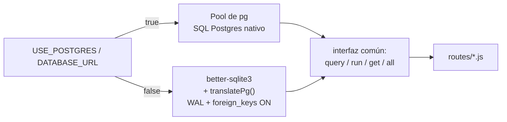
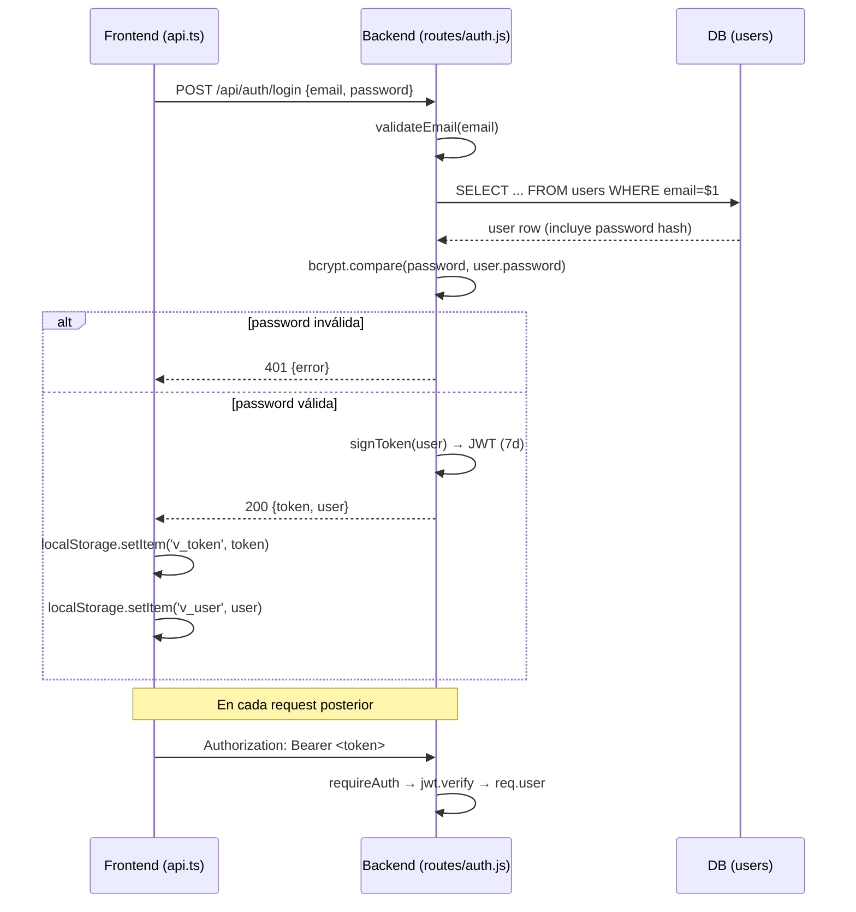

# BACKEND_CONTEXT.md — VoluntariAR API

> Detalle completo del backend Express. Complementa `API_CONTEXT.md` (que documenta cada endpoint individualmente) con la arquitectura, los flujos internos y las convenciones de código.

## 1. Arquitectura del backend

Express monolítico clásico, sin capas de servicio/repositorio: cada archivo de ruta contiene handlers que hacen validación + acceso a datos + formateo de respuesta en el mismo bloque `router.METHOD(...)`.

```
backend/
├── src/
│   ├── index.js            # bootstrap: cors, json parser, montaje de rutas, 404, error handler, listen
│   ├── db/index.js         # adaptador dual SQLite/Postgres — único punto de acceso a datos
│   ├── lib/
│   │   ├── email.js          # cliente mínimo de Resend (fetch nativo, sin SDK)
│   │   └── emailTemplates.js # plantillas HTML de los emails transaccionales
│   ├── middleware/auth.js  # requireAuth, optionalAuth, requireRole, signToken
│   └── routes/
│       ├── auth.js         # /api/auth/*
│       ├── projects.js     # /api/projects/*  (incluye comments, ratings, kpis)
│       ├── enrollments.js  # /api/enrollments/*
│       ├── ngos.js         # /api/ngos/*      (incluye empleados)
│       ├── voluntarios.js  # /api/voluntarios/* (habilidades del voluntario)
│       ├── messages.js     # /api/messages/*   (chat 1 a 1, REST)
│       └── notifications.js# /api/notifications/*
│   └── ws/
│       └── index.js        # servidor de WebSocket (chat en tiempo real), colgado del mismo puerto HTTP
└── scripts/
    ├── migrate.js          # DDL: 24 tablas, 18 índices, datos base (categorías/roles/habilidades)
    └── seed.js              # datos de demo idempotentes
```

Rutas de catálogo de solo lectura (`/api/categorias`, `/api/roles`, `/api/habilidades`) están definidas directamente en `src/index.js`, no en un archivo de ruta propio.

## 2. El adaptador de base de datos (`src/db/index.js`)

Pieza central de la arquitectura. Decide en el arranque:

```js
const USE_POSTGRES = process.env.USE_POSTGRES === 'true' || !!process.env.DATABASE_URL;
```

Expone la misma interfaz (`query`, `run`, `get`, `all`, `type`) sin importar el motor subyacente, para que las rutas puedan escribirse una sola vez.

### Rama PostgreSQL
- Usa `pg.Pool`, con `ssl: { rejectUnauthorized: false }` cuando hay `DATABASE_URL` (típico de Render).
- `get()` añade `LIMIT 1` automáticamente envolviendo la query en un subselect si no lo tiene ya.

### Rama SQLite
- Usa `better-sqlite3` (síncrono), con `journal_mode = WAL` y `foreign_keys = ON`.
- **Traduce sintaxis Postgres → SQLite sobre la marcha** vía `translatePg()`: reemplaza `$1,$2...` por `?`, `CURRENT_TIMESTAMP` por `datetime('now')`, `ILIKE` por `LIKE`, y variantes de `ON CONFLICT ... DO NOTHING` por `OR IGNORE`.
- Esta traducción es **regex-based y no exhaustiva**: no traduce `json_agg`, `jsonb_build_object`, `FILTER (WHERE ...)`, `GREATEST`, ni otras funciones específicas de Postgres. Por eso el código de rutas que necesita agregación JSON (ver `projects.js` GET `/`) tiene **dos caminos completamente distintos** según `db.type === 'postgres'`.
- **Placeholders `$N` repetidos:** la traducción de `$1, $2, ...` a `?` no es una simple sustitución 1 a 1 — usa una función `remapParams(sql, params)` que registra a qué índice de parámetro apunta cada aparición de `$N` y arma un array de parámetros alineado a cada `?`. Esto es necesario porque Postgres permite reusar el mismo `$N` más de una vez en una query (p. ej. `WHERE (a=$1 AND b=$2) OR (a=$2 AND b=$1)`), pero el binding posicional de SQLite exige un valor por cada `?`, no por cada número de parámetro único. *(Corregido — antes era una regex simple que rompía en silencio cualquier query con un placeholder reusado, sin lanzar error; ver `PROJECT_ANALYSIS.md §18`, bug B9.)* Al escribir queries nuevas para este adaptador, está bien reusar `$N` — el adaptador ya lo soporta correctamente en ambos motores.



**Implicación práctica para cualquier cambio futuro:** cualquier query nueva que use funciones agregadas de JSON, `RETURNING`, o sintaxis avanzada de Postgres debe implementarse dos veces (rama Postgres y rama SQLite) o probarse contra ambos motores. `GET /api/projects` ya hace esto (ver `API_CONTEXT.md`).

## 3. Middleware de autenticación (`src/middleware/auth.js`)

| Función | Comportamiento |
|---|---|
| `requireAuth(req,res,next)` | Exige header `Authorization: Bearer <token>`. Verifica con `jwt.verify`. Si falla → `401`. Si OK → `req.user = payload`. |
| `optionalAuth(req,res,next)` | Igual, pero nunca bloquea: si no hay token o es inválido, simplemente no setea `req.user` y sigue. Usado en endpoints públicos que quieren personalizar la respuesta si el visitante está logueado (p. ej. `GET /projects/:id` para incluir `my_enrollment`). |
| `requireRole(...roles)` | Debe usarse **después** de `requireAuth`. Si `req.user` no existe → `401`; si `req.user.role` no está en la lista permitida → `403`. Acepta arrays o argumentos sueltos (`roles.flat()`). |
| `signToken(user)` | Firma un JWT con payload `{ id, email, role, name }` y expiración `JWT_EXPIRES_IN` (default `7d`). |

`JWT_SECRET` tiene un fallback hardcodeado (`'voluntariar_dev_secret'`) si la env var no está seteada — aceptable en desarrollo, **riesgo de seguridad si se despliega sin configurar `JWT_SECRET`** (ver `PROJECT_ANALYSIS.md`).

## 4. Flujo de login / JWT (diagrama de secuencia)



## 5. Flujo de permisos por endpoint (patrón general)

La mayoría de los endpoints de escritura sobre recursos de una ONG siguen este patrón repetido en `projects.js`, `enrollments.js` y `ngos.js`:

```js
const ngo = await db.get('SELECT id FROM ngos WHERE user_id=$1', [req.user.id]);
const resource = await db.get('SELECT ... WHERE id=$1 AND ngo_id=$2', [req.params.id, ngo?.id]);
if (!resource) return res.status(404 /* o 403 */).json({ error: '...' });
```

Esto acopla la autorización a la consulta de datos (si el recurso no pertenece a la ONG del usuario, el `SELECT` simplemente no devuelve fila, y el endpoint responde 404 en vez de 403 — lo cual es una decisión de seguridad deliberada para no filtrar la existencia del recurso, aunque no está documentada como tal en el código).

## 6. Cómo se construyen las respuestas — funciones `fmt()`

Como el esquema de base de datos está en español (`titulo`, `descripcion`, `ubicacion`, `cupos`...) y el frontend espera inglés (`title`, `description`, `location`, `volunteers_needed`...), cada ruta que devuelve un recurso "de dominio" pasa la fila cruda por una función formateadora local:

- `projects.js::fmt(p)` — mapea proyecto DB → proyecto API, además parsea `roles_json`/`requisitos_json` (strings JSON) a arrays reales con `parseJson()`.
- `ngos.js::fmtNgo(n)` — mapea ONG DB → ONG API (`nombre→name`, `foto_perfil→logo`, `banner→cover_image`, `descripcion→description`, `mision→mission`, `ubicacion→location`).

**Ninguna función de formateo re-mapea `categoria_nombre` → `category`** — ver `API_CONTEXT.md` y `PROJECT_ANALYSIS.md` para el impacto de esto.

## 7. Helpers y validaciones

| Helper | Ubicación | Qué hace |
|---|---|---|
| `validateEmail/validateName/validatePassword` | `routes/auth.js` | Regex idénticas (copiadas) a las de `frontend/AuthModal.tsx` |
| `validateProject(body)` | `routes/projects.js` | Valida título, descripción, ubicación, duración (si `fugaz`), horas semanales (si `sostenido`), cupos |
| `parseJson(val)` | `routes/projects.js` | `JSON.parse` con try/catch que devuelve `[]` en error |
| `hasBadWord(text)` / `BLACKLIST` | `routes/projects.js` | Lista fija de ~11 palabras ofensivas en español; se reutiliza (copiada, no importada) en `frontend/ProjectDetails.tsx` |
| `fmt(p)` / `fmtNgo(n)` | `routes/projects.js`, `routes/ngos.js` | Formateo español→inglés de campos (ver §6) |

No existe una carpeta `src/helpers/` ni `src/utils/` — todo helper vive inline en el archivo de ruta que lo usa, lo que produce duplicación entre `projects.js` y el frontend.

## 8. Convenciones para nombres de campos (mapa de traducción)

| Concepto | Columna DB (español) | Campo API/frontend (inglés) |
|---|---|---|
| Proyecto: título | `titulo` | `title` |
| Proyecto: descripción corta | `descripcion` | `description` |
| Proyecto: descripción larga | `descripcion_full` | `full_description` |
| Proyecto: imagen | `foto_perfil` | `image` |
| Proyecto: ubicación | `ubicacion` | `location` |
| Proyecto: tipo (fugaz/sostenido) | `tipo` | `type` |
| Proyecto: cupos totales | `cupos` | `volunteers_needed` |
| Proyecto: cupos ocupados | `cupos_ocupados` | `current_volunteers` |
| Proyecto: meta de financiamiento | `meta_financiera` | `funding_goal` |
| Proyecto: recaudado | `recaudado` | `current_funding` |
| Proyecto: costo por persona | `costo` | `cost_per_person` |
| Proyecto: horas por semana | `horas_semanales` | `hours_per_week` |
| Proyecto: duración | `duracion` | `duration` |
| ONG: nombre | `nombre` | `name` |
| ONG: logo | `foto_perfil` | `logo` |
| ONG: portada | `banner` | `cover_image` |
| ONG: descripción | `descripcion` | `description` |
| ONG: misión | `mision` | `mission` |
| ONG: ubicación | `ubicacion` | `location` |
| Inscripción: mensaje del voluntario | `mensaje` | `message` **(el frontend envía `message`, el backend lee `mensaje` — bug, ver `PROJECT_ANALYSIS.md`)** |

Cualquier campo nuevo que se agregue a una tabla debe:
1. Agregarse al `CREATE TABLE` en `migrate.js`.
2. Agregarse (si aplica) al `fmt()`/`fmtNgo()` correspondiente para exponerse en inglés.
3. Agregarse al `interface` correspondiente en `frontend/src/lib/api.ts`.

**Excepción a tener en cuenta:** en `POST /api/projects` y `PUT /api/projects/:id`, el **body de entrada** ya viaja en inglés (`title`, `location`, `type`, `volunteers_needed`, etc.) — la traducción español↔inglés en este endpoint ocurre únicamente en la *respuesta* (`fmt()`), no en la *lectura* del body. Esto es distinto al resto del backend, donde la convención "DB en español" se refleja también en cómo se nombran las variables internas. Es la fuente del bug B5 (`PROJECT_ANALYSIS.md §13`): el código de `validateProject`/`POST`/`PUT` había sido escrito en algún momento leyendo `cupos` (español) del body en vez de `volunteers_needed` (inglés, el nombre real que envía el frontend), lo que impedía crear o editar cualquier proyecto. Al tocar este endpoint, verificar siempre contra `frontend/src/app/components/CreateVoluntariado.tsx` qué nombres de campo realmente viajan en el body.

No hay generación automática de tipos ni contrato compartido (tipo OpenAPI/tRPC) entre backend y frontend — la sincronización es 100% manual.

## 9. Notificaciones (patrón fire-and-forget)

Cada vez que ocurre un evento relevante (nueva inscripción, aprobación/rechazo), el endpoint que lo origina inserta una fila en `notifications` con `.catch(() => {})` para no bloquear la respuesta principal si la notificación falla:

```js
await db.run(`INSERT INTO notifications (...) VALUES (...)`, [...]).catch(() => {});
```

Esto significa que **fallos en la creación de notificaciones son silenciosos** — no hay logging del error, no hay reintento, y el usuario nunca se entera de que no recibió la notificación esperada.

## 10. Problemas detectados (resumen técnico — ver `PROJECT_ANALYSIS.md` para el análisis priorizado)

1. **`projects.js` y `ngos.js` definen rutas después de `module.exports = router`** (líneas 403+ en `projects.js`, y el comentario huérfano al final de `ngos.js` que referencia rutas de KPIs que en realidad están en `projects.js`). Funciona porque `module.exports` apunta al mismo objeto `router` que se sigue mutando, pero es un patrón confuso y frágil ante refactors.
2. ~~**Inconsistencia `message` vs `mensaje`** en el flujo de inscripción~~ — **Corregido.** El backend ahora acepta `message` en `POST /api/enrollments` y expone `mensaje AS message` en todas las lecturas (`GET /my`, `GET /project/:projectId`), manteniendo la columna DB en español. Ver `PROJECT_ANALYSIS.md §13`.
3. ~~**`GET /ngos/:id` y `GET /ngos/me` no hacen JOIN con `ngo_categorias`/`categorias`**~~ — **Corregido.** Ambas rutas ahora traen `categoria_nombre` igual que `GET /ngos`, `fmtNgo()` la mapea a `category`, y `PUT /ngos/me` persiste el cambio de categoría en `ngo_categorias`. Ver `PROJECT_ANALYSIS.md §13`. (Nota: `GET /ngos/:id/dashboard` sigue sin este JOIN — no se usa para mostrar categoría en ninguna pantalla actual.)
4. **Dependencias declaradas sin uso:** `multer` (no hay upload de archivos) y `uuid` (los IDs se generan en SQL, no en JS).
5. **Falta de índice en columnas usadas para búsqueda por `LIKE`** (`projects.titulo`, `projects.descripcion`, `ngos.nombre`) — los índices existentes cubren `ngo_id`, `status`, `tipo`, `ubicacion`, pero las búsquedas de texto libre en `GET /projects?search=` hacen table scan.
6. **La rama SQLite de `GET /projects` no filtra por múltiples categorías via agregación** de la misma forma que Postgres — usa un subquery `IN` distinto, y hace **N+1 queries** (una por fila devuelta) para enriquecer roles/requisitos/categoría, mientras que Postgres lo resuelve en una sola query con `json_agg`. Este es el único endpoint con dos implementaciones tan divergentes.

## 11. Posibles mejoras

- Extraer los helpers de validación y la blacklist a un módulo compartido (`src/lib/validators.js`, `src/lib/blacklist.js`) para eliminar la duplicación backend/frontend, o mejor, exponerlos vía un endpoint/paquete compartido.
- Introducir un contrato de tipos compartido (OpenAPI generado desde el backend, o un paquete `shared-types` en el monorepo) para que el frontend no dependa de mantener interfaces TS a mano sincronizadas con el `fmt()`.
- Mover la lógica de autorización "recurso pertenece a esta ONG" a un middleware reutilizable en vez de repetirla en cada handler.
- Sustituir el patrón `.catch(() => {})` en notificaciones por logging explícito (aunque se mantenga fire-and-forget).
- Unificar el path SQLite/Postgres de `GET /projects` detrás de una sola query con agregación portable, o documentar explícitamente por qué se bifurca.
