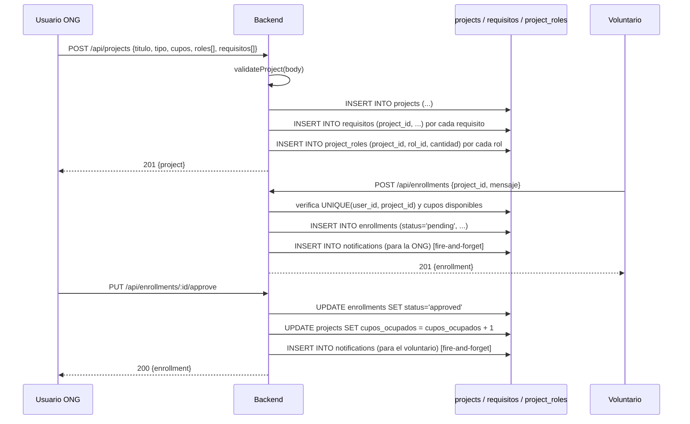

# DATABASE_CONTEXT.md — VoluntariAR

> Esquema completo generado por `backend/scripts/migrate.js` (única fuente de verdad del esquema — no hay migraciones incrementales versionadas, ver `PROJECT_ANALYSIS.md`). Soporta SQLite (local) y PostgreSQL (producción) con tipos adaptados dinámicamente (ver `BACKEND_CONTEXT.md §2`).

## 0. Notas de tipos según motor

| Placeholder en `migrate.js` | SQLite | PostgreSQL |
|---|---|---|
| `UUID_PK` | `TEXT PRIMARY KEY DEFAULT (expresión randomblob)` | `TEXT PRIMARY KEY DEFAULT gen_random_uuid()` |
| `NOW` | `DATETIME DEFAULT (datetime('now'))` | `TIMESTAMPTZ DEFAULT NOW()` |
| `BOOL` | `INTEGER` (0/1) | `BOOLEAN` |
| `JSONB` | `TEXT` | `JSONB` |

Todas las claves primarias son `TEXT` (UUID v4-like), no enteros autoincrementales.

## 1. Todas las tablas (24)

| # | Tabla | Propósito |
|---|---|---|
| 1 | `users` | Autenticación y datos base de cualquier usuario (voluntario, ONG, empresa) |
| 2 | `categorias` | Catálogo de categorías temáticas (ambiente, educación, salud, etc.) |
| 3 | `habilidades` | Catálogo de habilidades de voluntarios |
| 4 | `ngos` | Perfil extendido de ONG (1:1 con `users`) |
| 5 | `empresas` | Perfil extendido de empresa (1:1 con `users`) |
| 6 | `voluntarios` | Perfil extendido de voluntario (1:1 con `users`) |
| 7 | `empleados` | Miembros del equipo interno de una ONG |
| 8 | `projects` | Voluntariados/proyectos publicados por una ONG |
| 9 | `requisitos` | Requisitos de un proyecto (tabla normalizada, no JSON) |
| 10 | `roles` | Catálogo de roles de voluntariado (ej. "coordinador de logística") |
| 11 | `kpis` | Indicadores de impacto cargados por la ONG para un proyecto |
| 12 | `enrollments` | Inscripciones de voluntarios a proyectos |
| 13 | `donaciones` | Donaciones monetarias (usuario → proyecto/ONG) |
| 14 | `reuniones` | Reuniones virtuales agendadas para un proyecto |
| 15 | `comments` | Comentarios de usuarios en un proyecto |
| 16 | `ratings` | Calificaciones (1-5) de un usuario a un proyecto |
| 17 | `notifications` | Notificaciones in-app por usuario |
| 18 | `ngo_categorias` | N:M — ONG ↔ Categoría |
| 19 | `project_categorias` | N:M — Proyecto ↔ Categoría |
| 20 | `project_roles` | N:M — Proyecto ↔ Rol (con `cantidad` necesitada) |
| 21 | `voluntario_habilidades` | N:M — Voluntario ↔ Habilidad (con `nivel`) |
| 22 | `empresa_voluntariados` | N:M — Empresa ↔ Proyecto (patrocinio RSE, con `aporte`) |
| 23 | `ngo_follows` | N:M — Usuario sigue a ONG |
| 24 | `project_follows` | N:M — Usuario sigue Proyecto |
| 25 | `messages` | Mensajes del chat 1 a 1 (remitente, destinatario, cuerpo, leído) |

## 2. Detalle de columnas por tabla

### `users`
| Columna | Tipo | Restricciones |
|---|---|---|
| id | TEXT | PK |
| name | TEXT | NOT NULL |
| email | TEXT | NOT NULL, UNIQUE |
| password | TEXT | NOT NULL (hash bcrypt) |
| role | TEXT | NOT NULL, DEFAULT `'volunteer'`, CHECK IN (`volunteer`,`ngo`,`company`) |
| avatar | TEXT | |
| bio | TEXT | |
| location | TEXT | |
| created_at / updated_at | TIMESTAMP | DEFAULT now |

### `categorias`
id (PK) · nombre (UNIQUE, NOT NULL) · descripcion · icono · created_at

### `habilidades`
id (PK) · nombre (UNIQUE, NOT NULL) · descripcion · created_at

### `ngos`
| Columna | Tipo | Restricciones |
|---|---|---|
| id | TEXT | PK |
| user_id | TEXT | NOT NULL, UNIQUE, FK → `users(id)` ON DELETE CASCADE |
| nombre | TEXT | NOT NULL |
| descripcion, foto_perfil, banner, mision | TEXT | |
| alias | TEXT | UNIQUE |
| ubicacion | TEXT | |
| founded | TEXT | |
| followers | INTEGER | DEFAULT 0, CHECK ≥ 0 |
| created_at / updated_at | TIMESTAMP | |

### `empresas`
Igual forma que `ngos` pero con `industria` en vez de `alias`/`founded`. id · user_id (UNIQUE FK→users) · nombre · descripcion · mision · ubicacion · foto_perfil · banner · industria · followers · created_at · updated_at.

### `voluntarios`
id · user_id (UNIQUE FK→users) · nombre · apellido · descripcion · ubicacion · foto_perfil · banner · cv_url · created_at · updated_at.

### `empleados`
id · ngo_id (FK→ngos, CASCADE) · nombre · apellido · email · foto_perfil · rol (CHECK IN `coordinador`,`comunicador`,`admin`,`otro`, default `coordinador`) · created_at.

### `projects`
| Columna | Tipo | Restricciones |
|---|---|---|
| id | TEXT | PK |
| ngo_id | TEXT | NOT NULL, FK → `ngos(id)` ON DELETE CASCADE |
| titulo | TEXT | NOT NULL |
| descripcion | TEXT | NOT NULL |
| descripcion_full | TEXT | |
| foto_perfil, banner | TEXT | |
| alias | TEXT | UNIQUE |
| tipo | TEXT | NOT NULL, DEFAULT `fugaz`, CHECK IN (`fugaz`,`sostenido`) |
| status | TEXT | NOT NULL, DEFAULT `active`, CHECK IN (`active`,`completed`,`cancelled`) |
| ubicacion | TEXT | NOT NULL |
| fecha_inicio, fecha_fin | TEXT | |
| cupos | INTEGER | NOT NULL, DEFAULT 0, CHECK ≥ 0 |
| cupos_ocupados | INTEGER | NOT NULL, DEFAULT 0, CHECK ≥ 0 |
| meta_financiera | REAL | DEFAULT 0, CHECK ≥ 0 |
| recaudado | REAL | DEFAULT 0, CHECK ≥ 0 |
| costo | REAL | DEFAULT 0, CHECK ≥ 0 |
| horas_semanales | INTEGER | CHECK NULL o > 0 (solo aplica si `tipo='sostenido'`, validado en la app, no en el CHECK) |
| duracion | TEXT | (solo aplica si `tipo='fugaz'`, validado en la app) |
| followers | INTEGER | DEFAULT 0, CHECK ≥ 0 |
| created_at / updated_at | TIMESTAMP | |

**Nota:** no existe un `CHECK` a nivel de base de datos que impida `cupos_ocupados > cupos` — esa invariante se protege solo en el código de `enrollments.js` al aprobar una inscripción (ver `API_CONTEXT.md`).

### `requisitos`
id · project_id (FK→projects, CASCADE) · descripcion (NOT NULL) · cantidad (DEFAULT 1, CHECK > 0) · tipo (DEFAULT `general`) · created_at.

### `roles`
id · nombre (UNIQUE, NOT NULL) · descripcion · created_at.

### `kpis`
id · project_id (FK→projects, CASCADE) · nombre (NOT NULL) · descripcion · valor (REAL) · tipo_valor (CHECK IN `numero`,`porcentaje`,`texto`,`booleano`, default `numero`) · unidad · fecha · created_at.

### `enrollments`
| Columna | Tipo | Restricciones |
|---|---|---|
| id | TEXT | PK |
| user_id | TEXT | NOT NULL, FK → `users(id)` CASCADE |
| project_id | TEXT | NOT NULL, FK → `projects(id)` CASCADE |
| status | TEXT | NOT NULL, DEFAULT `pending`, CHECK IN (`pending`,`approved`,`rejected`,`cancelled`) |
| mensaje | TEXT | mensaje del voluntario a la ONG (la columna DB sigue en español; el backend lo recibe/expone como `message` en la API — ver `API_CONTEXT.md` y `PROJECT_ANALYSIS.md §13`) |
| horas_realizadas | REAL | DEFAULT 0, CHECK ≥ 0 |
| created_at / updated_at | TIMESTAMP | |
| — | — | `UNIQUE(user_id, project_id)` → un voluntario no puede inscribirse dos veces al mismo proyecto |

### `donaciones`
id · user_id (NOT NULL FK→users CASCADE) · project_id (FK→projects, ON DELETE **SET NULL**) · ngo_id (FK→ngos, ON DELETE **SET NULL**) · monto (NOT NULL, CHECK > 0) · fecha (TIMESTAMP) · estado (CHECK IN `pendiente`,`completada`,`fallida`,`reembolsada`, default `completada`) · created_at.

> Tabla presente en el esquema pero **sin ningún endpoint que la use** en `backend/src/routes/` — funcionalidad de donaciones no implementada a nivel API/UI (ver `PROJECT_ANALYSIS.md`).

### `reuniones`
id · empleado_id (FK→empleados, ON DELETE SET NULL) · user_id (NOT NULL FK→users CASCADE) · project_id (NOT NULL FK→projects CASCADE) · fecha (NOT NULL) · horario (NOT NULL) · link · estado (CHECK IN `programada`,`realizada`,`cancelada`, default `programada`) · created_at.

> También sin endpoints propios implementados — tabla de esquema "adelantada" a funcionalidad no construida aún.

### `comments`
id · project_id (NOT NULL FK→projects CASCADE) · user_id (NOT NULL FK→users CASCADE) · comment (NOT NULL) · created_at.

### `ratings`
id · project_id (NOT NULL FK→projects CASCADE) · user_id (NOT NULL FK→users CASCADE) · rating (NOT NULL, CHECK 1-5) · comment · created_at · `UNIQUE(user_id, project_id)` (un usuario califica una sola vez por proyecto).

### `notifications`
id · user_id (NOT NULL FK→users CASCADE) · type (NOT NULL) · title (NOT NULL) · body · read (BOOLEAN/INTEGER, default false/0) · data (JSONB/TEXT) · created_at.

### `messages`
id · sender_id (NOT NULL FK→users CASCADE) · receiver_id (NOT NULL FK→users CASCADE) · body (NOT NULL) · read (BOOLEAN/INTEGER, default false/0) · created_at. Sin `UNIQUE` — un mismo par de usuarios puede tener cualquier cantidad de mensajes. Índices en `sender_id`, `receiver_id` y `created_at` (este último para ordenar el historial y la lista de conversaciones).

### Tablas intermedias N:M (18–24)

| Tabla | PK compuesta | Columnas extra |
|---|---|---|
| `ngo_categorias` | (ngo_id, categoria_id) | — |
| `project_categorias` | (project_id, categoria_id) | — |
| `project_roles` | (project_id, rol_id) | `cantidad` (DEFAULT 1, CHECK > 0) |
| `voluntario_habilidades` | (user_id, habilidad_id) | `nivel` (CHECK IN `basico`,`intermedio`,`avanzado`, default `basico`) |
| `empresa_voluntariados` | (empresa_id, project_id) | `aporte` (REAL, DEFAULT 0, CHECK ≥ 0), `created_at` |
| `ngo_follows` | (user_id, ngo_id) | `created_at` |
| `project_follows` | (user_id, project_id) | `created_at` |

Todas con `ON DELETE CASCADE` en ambas FKs.

## 3. Diagrama Entidad-Relación (Mermaid)

```mermaid
erDiagram
    users ||--o| ngos : "1:1 (si role=ngo)"
    users ||--o| empresas : "1:1 (si role=company)"
    users ||--o| voluntarios : "1:1 (si role=volunteer)"
    users ||--o{ enrollments : "se inscribe"
    users ||--o{ comments : "comenta"
    users ||--o{ ratings : "califica"
    users ||--o{ notifications : "recibe"
    users ||--o{ donaciones : "dona"
    users ||--o{ ngo_follows : "sigue ONG"
    users ||--o{ project_follows : "sigue proyecto"
    users ||--o{ voluntario_habilidades : "tiene"

    ngos ||--o{ projects : "publica"
    ngos ||--o{ empleados : "emplea"
    ngos ||--o{ ngo_categorias : "clasificada en"
    ngos ||--o{ ngo_follows : "es seguida"
    ngos ||--o{ donaciones : "recibe (opcional)"

    empresas ||--o{ empresa_voluntariados : "patrocina"

    projects ||--o{ enrollments : "recibe"
    projects ||--o{ requisitos : "requiere"
    projects ||--o{ project_roles : "necesita"
    projects ||--o{ kpis : "mide"
    projects ||--o{ comments : "recibe"
    projects ||--o{ ratings : "recibe"
    projects ||--o{ project_categorias : "clasificado en"
    projects ||--o{ donaciones : "recibe (opcional)"
    projects ||--o{ reuniones : "agenda"
    projects ||--o{ empresa_voluntariados : "patrocinado por"
    projects ||--o{ project_follows : "es seguido"

    categorias ||--o{ ngo_categorias : ""
    categorias ||--o{ project_categorias : ""
    roles ||--o{ project_roles : ""
    habilidades ||--o{ voluntario_habilidades : ""
    empleados ||--o{ reuniones : "coordina (opcional)"

    users {
        text id PK
        text name
        text email UK
        text role "volunteer|ngo|company"
    }
    ngos {
        text id PK
        text user_id FK_UK
        text nombre
    }
    projects {
        text id PK
        text ngo_id FK
        text titulo
        text tipo "fugaz|sostenido"
        text status "active|completed|cancelled"
        int cupos
        int cupos_ocupados
    }
    enrollments {
        text id PK
        text user_id FK
        text project_id FK
        text status "pending|approved|rejected|cancelled"
        text mensaje
        real horas_realizadas
    }
```

## 4. Claves primarias

Todas las tablas "principales" (1–17) usan `id TEXT PRIMARY KEY` generado por default de base de datos. Las 7 tablas intermedias (18–24) usan **clave primaria compuesta** sobre las dos FKs (sin columna `id` propia).

## 5. Claves foráneas (resumen de política de borrado)

| Relación | ON DELETE |
|---|---|
| `ngos.user_id → users.id` | CASCADE |
| `empresas.user_id → users.id` | CASCADE |
| `voluntarios.user_id → users.id` | CASCADE |
| `empleados.ngo_id → ngos.id` | CASCADE |
| `projects.ngo_id → ngos.id` | CASCADE |
| `requisitos.project_id → projects.id` | CASCADE |
| `kpis.project_id → projects.id` | CASCADE |
| `enrollments.user_id → users.id` / `.project_id → projects.id` | CASCADE |
| `donaciones.project_id → projects.id` | **SET NULL** |
| `donaciones.ngo_id → ngos.id` | **SET NULL** |
| `donaciones.user_id → users.id` | CASCADE |
| `reuniones.empleado_id → empleados.id` | **SET NULL** |
| `reuniones.user_id → users.id` / `.project_id → projects.id` | CASCADE |
| `comments.*`, `ratings.*`, `notifications.user_id` | CASCADE |
| todas las tablas N:M (18–24) | CASCADE en ambos lados |

Borrar un `user` en cascada elimina: su perfil de ONG/empresa/voluntario, todos sus proyectos (si es ONG, en cascada también borra inscripciones/comentarios/ratings/kpis/requisitos de esos proyectos), sus inscripciones, comentarios, ratings, notificaciones, seguimientos. Es un borrado destructivo total sin soft-delete.

## 6. Índices (17)

| Índice | Tabla(columna) | Propósito |
|---|---|---|
| `idx_projects_ngo` | projects(ngo_id) | listar proyectos de una ONG |
| `idx_projects_status` | projects(status) | filtrar activos/completados |
| `idx_projects_tipo` | projects(tipo) | filtrar fugaz/sostenido |
| `idx_projects_ubicacion` | projects(ubicacion) | filtrar por ubicación |
| `idx_enrollments_user` | enrollments(user_id) | inscripciones de un voluntario |
| `idx_enrollments_project` | enrollments(project_id) | inscriptos de un proyecto |
| `idx_enrollments_status` | enrollments(status) | filtrar pendientes/aprobadas |
| `idx_comments_project` | comments(project_id) | comentarios de un proyecto |
| `idx_ratings_project` | ratings(project_id) | calificaciones de un proyecto |
| `idx_notifications_user` | notifications(user_id) | notificaciones de un usuario |
| `idx_notifications_read` | notifications(read) | filtrar no leídas |
| `idx_requisitos_project` | requisitos(project_id) | requisitos de un proyecto |
| `idx_kpis_project` | kpis(project_id) | KPIs de un proyecto |
| `idx_donaciones_user` | donaciones(user_id) | donaciones de un usuario |
| `idx_donaciones_project` | donaciones(project_id) | donaciones de un proyecto |
| `idx_reuniones_project` | reuniones(project_id) | reuniones de un proyecto |
| `idx_reuniones_user` | reuniones(user_id) | reuniones de un usuario |
| `idx_empleados_ngo` | empleados(ngo_id) | empleados de una ONG |

**No hay índices sobre columnas de texto libre usadas en búsquedas `LIKE`/`ILIKE`** (`projects.titulo`, `projects.descripcion`, `ngos.nombre`) — ver `PROJECT_ANALYSIS.md` para el impacto de rendimiento.

## 7. Restricciones (CHECK) notables

- `users.role IN ('volunteer','ngo','company')`
- `projects.tipo IN ('fugaz','sostenido')`, `projects.status IN ('active','completed','cancelled')`
- `enrollments.status IN ('pending','approved','rejected','cancelled')`, `UNIQUE(user_id, project_id)`
- `ratings.rating BETWEEN 1 AND 5`, `UNIQUE(user_id, project_id)`
- Todos los contadores (`followers`, `cupos`, `cupos_ocupados`, `horas_realizadas`, `monto`, `aporte`) tienen `CHECK ≥ 0` (o `> 0` cuando el valor cero no tiene sentido, como `donaciones.monto` o `ratings.rating`).

## 8. Seed (`backend/scripts/seed.js`)

Datos de demostración, **idempotente** (usa `INSERT ... ON CONFLICT DO NOTHING` / `INSERT OR IGNORE` según el motor — vía el helper del adaptador). Crea aproximadamente:

- 3 usuarios voluntarios + 4 ONGs + 1 empresa (con emails y contraseña predecibles para credenciales de demo, documentadas en el `README.md` de la raíz).
- Categorías base (ambiente, educación, salud, animales, etc.) y roles/habilidades de catálogo.
- ~12 proyectos distribuidos entre las 4 ONGs, con requisitos y roles asociados.
- IDs legibles a mano (`user-vol-1`, `ngo-1`, `project-...`) en vez de UUIDs generados, para que las credenciales de demo sean estables entre corridas.

## 9. Flujo de creación de datos (alta de un proyecto → inscripción → aprobación)



## 10. Problemas detectados

1. **Sin migraciones incrementales**: `migrate.js` solo sabe crear tablas nuevas (`CREATE TABLE IF NOT EXISTS`). Agregar una columna a una tabla existente en una base ya desplegada requiere escribir un `ALTER TABLE` manual fuera de este script, y no hay ningún mecanismo (tabla de versión, `schema_migrations`) que registre qué cambios ya se aplicaron.
2. **`donaciones` y `reuniones` son tablas "huérfanas"**: existen en el esquema con FKs, CHECKs e índices completos, pero **ningún endpoint del backend las usa**. Indican funcionalidad planificada pero no construida — cualquier IA que trabaje sobre este proyecto no debe asumir que existe un flujo de donaciones o de reuniones solo porque la tabla está.
3. **`cupos_ocupados` no tiene un CHECK que lo limite a `<= cupos`** — la integridad depende enteramente de que el código de aplicación (`enrollments.js`) incremente/decremente correctamente; una escritura directa a la base (o un bug futuro) podría dejar cupos negativos "lógicos" (cupos ocupados mayor a cupos totales) sin que la base de datos lo impida.
4. **Sin soft-delete** en ninguna tabla: todo borrado es físico y en cascada. Borrar una ONG borra permanentemente todo su historial de proyectos, inscripciones, comentarios y calificaciones — sin papelera de reciclaje ni auditoría.
5. **Falta de índices en columnas de búsqueda de texto libre** (ver §6).
6. **Tipos JSON (`notifications.data`) son `TEXT` plano en SQLite**: no hay validación de que el contenido sea JSON válido a nivel de base de datos; se confía en que el backend siempre escriba `JSON.stringify(...)` correctamente.

## 11. Mejoras posibles

- Introducir una tabla `schema_migrations` (o adoptar una herramienta de migraciones como `node-pg-migrate`/`Knex`) para poder versionar cambios de esquema incrementales sin reescribir `migrate.js`.
- Agregar un `CHECK (cupos_ocupados <= cupos)` a `projects` (compatible con ambos motores).
- Decidir si `donaciones`/`reuniones` se implementan pronto o se remueven del esquema hasta que haya un sprint dedicado, para no confundir a futuros desarrolladores/IAs.
- Agregar índices `LIKE`-friendly (o, en Postgres, `pg_trgm`/`GIN`) sobre `projects.titulo`, `projects.descripcion` y `ngos.nombre` si la búsqueda de texto libre se vuelve un caso de uso central.
- Evaluar soft-delete (`deleted_at`) al menos en `users`, `ngos` y `projects`, dado que hoy borrar una cuenta es irreversible y en cascada.
