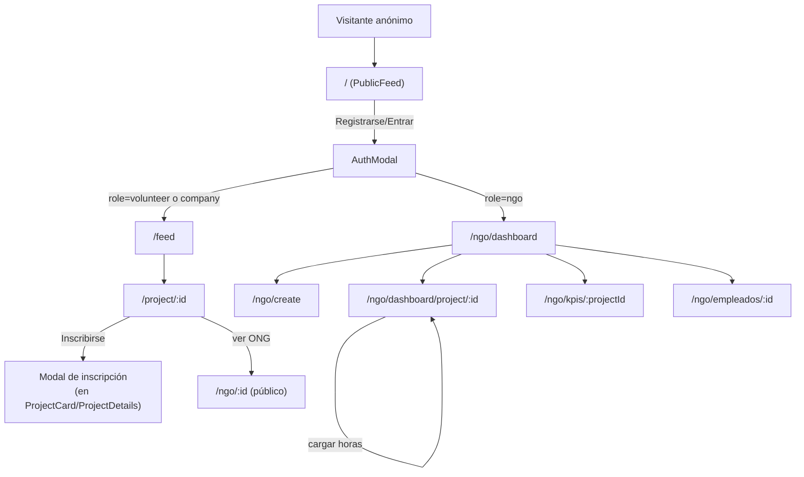

# FRONTEND_CONTEXT.md — VoluntariAR Web

> Detalle completo del frontend React/Vite. Leer junto con `PROJECT_CONTEXT.md §6-7` (navegación general y contrato con backend).

## 1. Arquitectura React

SPA de React 18 + React Router 7 (`createBrowserRouter`, data router API pero **sin usar `loader`/`action`** — toda la carga de datos ocurre en `useEffect` dentro de cada componente, al estilo "clásico"). No hay code-splitting (`lazy`) ni Suspense boundaries de datos. No hay gestor de estado global aparte de `AuthContext`; cada pantalla mantiene su propio estado con `useState`.

```
main.tsx
 └─ <StrictMode>
     └─ <AuthProvider>            (AuthContext.tsx)
         └─ <RouterProvider>       (routes.tsx)
             ├─ <Root/>            layout para "/", "/feed", "/explore", "/project/:id",
             │                     "/participation", "/notifications", "/profile", "/ngo/:id"
             │                     → <BottomNav/> + <AuthModal/>
             └─ <NGOLayout/>       layout para "/ngo/*" (dashboard, create, empleados, kpis, profile)
                                   → <NGOSidebarNav/> + <NGOBottomNav/> + <AuthModal/>
```

## 2. Organización de carpetas

```
frontend/src/
├── main.tsx                  # bootstrap: StrictMode + AuthProvider + RouterProvider
├── app/
│   ├── routes.tsx             # todas las rutas (createBrowserRouter)
│   └── components/            # 22 archivos .tsx — screens + layouts + widgets
├── lib/
│   ├── api.ts                 # cliente HTTP centralizado + TODOS los tipos TS de dominio
│   └── AuthContext.tsx        # sesión global (Context + Provider + hook useAuth)
└── styles/
    ├── globals.css             # Tailwind + tema custom (design tokens) + fuentes
    └── (assets, fonts)
```

No existen carpetas `hooks/`, `services/`, `types/`, `utils/` separadas — todo vive en `lib/` (2 archivos) y `app/components/` (plano, sin subcarpetas por dominio).

## 3. Todas las páginas (rutas)

| Ruta | Componente | Layout | Rol requerido (solo backend) |
|---|---|---|---|
| `/` | `PublicFeed` | `Root` | Público (redirige si ya hay sesión) |
| `/feed` | `MainFeed` | `Root` | volunteer/company (sin guarda real en frontend) |
| `/explore` | `ExploreScreen` | `Root` | cualquiera logueado |
| `/project/:id` | `ProjectDetails` | `Root` | público (con `optionalAuth`) |
| `/participation` | `MyParticipation` | `Root` | volunteer |
| `/notifications` | `NotificationsScreen` | `Root` | cualquiera logueado |
| `/messages` | `MessagesScreen` | `Root` | cualquiera logueado |
| `/messages/:userId` | `ChatThread` | `Root` | cualquiera logueado |
| `/profile` | `VolunteerProfile` | `Root` | volunteer |
| `/ngo/:id` | `NGOPublicProfile` | `Root` | público |
| `/ngo/dashboard` | `NGODashboard` | `NGOLayout` | ngo |
| `/ngo/create` | `CreateVoluntariado` | `NGOLayout` | ngo (sin guarda en frontend) |
| `/ngo/dashboard/project/:id` | `NGOProjectDetail` | `NGOLayout` | ngo |
| `/ngo/profile` | `NGOOwnProfile` | `NGOLayout` | ngo |
| `/ngo/empleados/:id` | `NGOEmpleados` | `NGOLayout` | ngo |
| `/ngo/kpis/:projectId` | `NGOKPIs` | `NGOLayout` | ngo |
| `/ngo/messages` | `MessagesScreen` | `NGOLayout` | ngo |
| `/ngo/messages/:userId` | `ChatThread` | `NGOLayout` | ngo |

`OnboardingScreen.tsx` existe como archivo pero **no está registrado en `routes.tsx`** — código muerto/no alcanzable.

## 4. Todos los componentes

### Layouts / navegación
- `Root.tsx` — layout del lado "voluntario/público": `<Outlet/>` + `<BottomNav/>` + `<AuthModal/>`.
- `NGOLayout.tsx` — layout del lado "ONG": `<NGOSidebarNav/>` (desktop) + `<NGOBottomNav/>` (mobile) + `<Outlet/>` + `<AuthModal/>`.
- `BottomNav.tsx` — navegación inferior mobile del lado voluntario.
- `NGOBottomNav.tsx` / `NGOSidebarNav.tsx` — navegación del lado ONG (mobile y desktop respectivamente).
- `AuthModal.tsx` — modal de login/registro, controlado por estado global de `AuthContext` (`isAuthModalOpen`, `openAuthModal(mode)`). Único punto de entrada de autenticación en toda la app (no hay páginas `/login` o `/register` dedicadas).

### Pantallas — lado voluntario
- `PublicFeed.tsx` — feed público sin login, con CTA a registro; redirige automáticamente si detecta sesión activa.
- `MainFeed.tsx` — feed autenticado, filtros por tipo/ubicación/categoría.
- `ExploreScreen.tsx` — búsqueda/exploración de proyectos con filtros más amplios.
- `ProjectDetails.tsx` — detalle de un proyecto: info completa, botón de inscripción, comentarios, calificación (si ya participó). Reimplementa la blacklist de palabras del backend para validar comentarios en el cliente antes de enviarlos.
- `ProjectCard.tsx` — tarjeta reutilizada en feeds; incluye el modal de inscripción rápida (envía `{project_id, message}` — ver bug de nomenclatura en `PROJECT_ANALYSIS.md`).
- `MyParticipation.tsx` — historial de inscripciones del voluntario logueado, con estado (pendiente/aprobada/rechazada) y horas acumuladas.
- `VolunteerProfile.tsx` — perfil propio editable, incluyendo selección de habilidades (chips desde el catálogo `api.catalog.habilidades()` + nivel por habilidad, guardado vía `api.voluntarios.habilidades.update`). Usa `api.auth.me()` para leer el perfil (ya no hace `fetch` directo — corregido junto con el bug B7 de `PROJECT_ANALYSIS.md §17`).
- `NotificationsScreen.tsx` — lista de notificaciones, marcar como leídas.
- `OnboardingScreen.tsx` — **no enrutado**, código muerto.

### Pantallas — lado ONG
- `NGODashboard.tsx` — lista de proyectos propios + resumen de inscripciones pendientes por proyecto (hace una request por proyecto — patrón N+1).
- `CreateVoluntariado.tsx` — formulario de alta/edición de proyecto (mismo componente sirve para crear y editar, diferenciado por `projectId` en query string). Reimplementa validaciones de fecha/cupos/duración ya presentes en el backend.
- `NGOProjectDetail.tsx` — detalle de proyecto desde la óptica de la ONG: lista de inscriptos, aprobar/rechazar, cargar horas.
- `NGOOwnProfile.tsx` — perfil de la ONG editable (nombre, descripción, misión, ubicación, categoría — con el bug de `category` nunca poblado, ver `BACKEND_CONTEXT.md §10`).
- `NGOPublicProfile.tsx` — vista pública del perfil de una ONG (accesible sin login desde `/ngo/:id`), lista sus proyectos activos.
- `NGOEmpleados.tsx` — gestión de empleados/miembros del equipo de la ONG. **No usa `api.ts`** — `fetch` directo con token manual desde `localStorage`.
- `NGOKPIs.tsx` — CRUD completo (alta/edición/borrado) de indicadores de impacto por proyecto, con resumen visual. Usa `api.projects.kpis.*` (corregido — ver `PROJECT_ANALYSIS.md §13`, antes hacía `fetch` directo).

### Chat
- `MessagesScreen.tsx` — lista de conversaciones (compartido entre voluntario y ONG, ver `PROJECT_ANALYSIS.md §18`).
- `ChatThread.tsx` — hilo de una conversación puntual: historial, envío (WS con fallback a REST), marcado automático de leído al abrir.

### Otros
- `ReviewModal.tsx` — modal de calificación/reseña que un voluntario deja sobre un proyecto ya finalizado.

## 5. Hooks

No hay hooks custom (no existe `useX.ts` fuera de `useAuth` exportado por `AuthContext.tsx` y `useChat` exportado por `ChatContext.tsx`). Todo el "data fetching" se hace con `useEffect` + `useState` local, repetido componente a componente (patrón: `loading`, `error`, `data` como tres `useState` separados en casi cada pantalla).

## 6. Contexts

Dos contexts: `AuthContext` (`lib/AuthContext.tsx`) y `ChatContext` (`lib/ChatContext.tsx`, agregado con la feature de chat — ver `PROJECT_ANALYSIS.md §18`).

```ts
interface AuthContextValue {
  user: User | null;
  token: string | null;
  loading: boolean;               // true mientras se revalida sesión al montar
  isAuthModalOpen: boolean;
  authModalMode: 'login' | 'register';
  login(email, password): Promise<void>;
  register(data): Promise<void>;
  logout(): void;
  openAuthModal(mode?): void;
  closeAuthModal(): void;
  updateUser(partial: Partial<User>): void;
}
```

- Al montar, si hay `v_token` en `localStorage` pero no `v_user`, llama a `GET /api/auth/me` para hidratar; si el token es inválido, limpia ambas claves.
- `login`/`register` llaman a `api.auth.login`/`api.auth.register`, guardan en `localStorage` (`v_token`, `v_user`) y actualizan el estado.
- `logout` es puramente client-side: borra `localStorage` y el estado en memoria. **No invalida el token en el servidor** (no existe endpoint de logout/blacklist).

```ts
interface ChatContextValue {
  conversations: Conversation[];
  unreadTotal: number;
  connected: boolean;             // estado de la conexión de WebSocket
  refreshConversations(): void;
  onMessage(cb): () => void;      // suscripción a mensajes entrantes por WS
  sendViaSocket(to, body): boolean; // intenta mandar por WS; false si no hay conexión
}
```

- Montado en `main.tsx` **dentro** de `AuthProvider` (necesita `useAuth()` para saber cuándo abrir/cerrar el socket).
- Abre la conexión de WebSocket (`new WebSocket(...)`) cuando hay `user`+`token`, la cierra cuando no. La URL se deriva de `BASE` (la misma constante que usa el cliente REST) reemplazando `/api` por `/ws` y `http` por `ws`.
- Mantiene `conversations` refrescándose vía `GET /api/messages/conversations` cada vez que llega un mensaje nuevo por WS, y expone `unreadTotal` (suma de no leídos) para los badges de navegación.
- `onMessage(cb)` permite que `ChatThread.tsx` se suscriba a mensajes entrantes sin que `ChatContext` necesite saber en qué hilo está parado el usuario — el componente filtra por `sender_id`/`receiver_id` él mismo.

## 7. Servicios / API (`lib/api.ts`)

Cliente HTTP centralizado, sin dependencias externas (fetch nativo). Estructura:

```ts
const API_URL = import.meta.env.VITE_API_URL;

async function request(path, options) {
  const token = localStorage.getItem('v_token');
  const res = await fetch(`${API_URL}${path}`, {
    headers: { 'Content-Type': 'application/json',
               ...(token && { Authorization: `Bearer ${token}` }) },
    ...options,
  });
  const data = await res.json();
  if (!res.ok) throw new Error(data.error || 'Error');
  return data;
}

export const api = {
  auth: { register, login, me, updateMe },
  projects: { list, get, create, update, remove, comment, rate, kpis... },
  enrollments: { enroll, byProject, byVolunteer, approve, reject, logHours },
  ngos: { list, get, me, updateMe, employees... },
  notifications: { list, markRead },
};
```

Todos los tipos de dominio (`User`, `Project`, `NGO`, `Enrollment`, `Notification`, etc.) están definidos como `interface` en este mismo archivo — no hay un módulo `types/` separado.

**Componentes que rompen este patrón** (fetch directo, no vía `api.ts`): `NGOEmpleados.tsx`. *(`NGOKPIs.tsx` fue migrado a `api.ts` — ver `PROJECT_ANALYSIS.md §13`.)*

## 8. Modelos TypeScript (resumen — ver `api.ts` para el detalle campo por campo)

| Interface | Corresponde a |
|---|---|
| `User` | fila de `users` (id, name, email, role, created_at) |
| `Project` | proyecto formateado por `fmt()` del backend — incluye `roles: string[]`, `requirements: string[]`, `category?: string`, `my_enrollment?: Enrollment` |
| `NGO` | ONG formateada por `fmtNgo()` — incluye `category?: string` (**nunca poblado**, ver `BACKEND_CONTEXT.md §10**) |
| `Enrollment` | inscripción: `id, project_id, volunteer_id, status, message?, hours_logged, created_at` |
| `Notification` | `id, user_id, type, content, read, created_at` |

## 9. Flujo de navegación (detalle por rol)



## 10. Flujo de autenticación (frontend)

1. Usuario abre `AuthModal` (login o registro) desde cualquier pantalla.
2. Al submit, `AuthContext.login()`/`register()` llama a `api.auth.*`.
3. Éxito → `localStorage.setItem('v_token', ...)`, `setUser(...)`, `closeAuthModal()`.
4. Componentes como `PublicFeed` observan `user` vía `useAuth()` y redirigen automáticamente con `navigate()` en un `useEffect` cuando detectan sesión (`user.role === 'ngo' ? '/ngo/dashboard' : '/feed'`) — nótese que `company` cae en la misma rama que `volunteer` porque no hay ruta propia para empresas.
5. Error → el modal muestra `err.message` (el string ya viene en español desde el backend).

No hay persistencia de "a dónde volver" tras el login — siempre redirige a la home del rol, perdiendo el contexto de si el usuario estaba intentando inscribirse a un proyecto específico.

## 11. Estado global

Limitado a `AuthContext`. No hay estado global de UI (temas, filtros persistentes, carrito, etc.) — cada pantalla resetea sus filtros al desmontar/montar.

## 12. Manejo de errores

- Sin *error boundary* de React en ningún nivel — un throw no capturado en render rompe la pantalla completa (pantalla en blanco), no solo un componente.
- Cada componente atrapa errores de `fetch`/`api.*` con `try/catch` local y los muestra con un `useState<string|null>` propio, normalmente renderizado como texto rojo inline — no hay un componente `<ErrorBanner/>` reutilizable ni un sistema de toasts/notificaciones de error.
- No hay reintento automático ni manejo específico de 401 (expiración de sesión) salvo en `NGODashboard`, que inspecciona el string del mensaje de error buscando "Token"/"autenticado" para decidir redirigir a `/`.

## 13. Convenciones de componentes

- Cada componente es un archivo `.tsx` con export nombrado (no default), nombrado igual que el archivo.
- Sin `React.memo`, sin `useCallback`/`useMemo` — no hay optimizaciones de re-render (razonable dado el tamaño de la app).
- Sin PropTypes ni `interface Props` compartida — cada componente define su propio `Props` inline si recibe alguna (la mayoría son "screen-level" y no reciben props, solo leen `useParams()`/`useAuth()`).

## 14. Convenciones de estilos

- Tailwind CSS 4 utilitario, clases inline en el JSX (no hay CSS Modules ni styled-components).
- `styles/globals.css` define variables de tema (colores, radios, fuentes) como custom properties CSS, consumidas por las clases de Tailwind vía `@theme` (Tailwind 4).
- Iconografía consistente con `lucide-react`.
- No hay un sistema de componentes UI compartido (no hay `Button.tsx`, `Card.tsx`, `Input.tsx` genéricos) — cada pantalla reescribe sus propios `<button className="...">` con las mismas clases repetidas copy-pasteadas. Esto es consistente con el origen "Figma-to-code" del proyecto (ver `PROJECT_CONTEXT.md §11`).

## 15. Problemas detectados

1. **`OnboardingScreen.tsx` no está enrutado** — código muerto, o una ruta que falta agregar (ambigüedad a resolver con el dueño del proyecto antes de borrar el archivo).
2. ~~**`NGOKPIs.tsx` y `NGOEmpleados.tsx` evitan `api.ts`**~~ — **`NGOKPIs.tsx` corregido** (migrado a `api.projects.kpis.*`, ver `PROJECT_ANALYSIS.md §13`). `NGOEmpleados.tsx` sigue pendiente.
3. **`ProjectCard.tsx` envía `message` al backend, que espera `mensaje`** → el mensaje del voluntario a la ONG se pierde silenciosamente (no hay error, el campo simplemente no se persiste).
4. **Sin guardas de rol/ruta en el frontend**: cualquier usuario (incluso sin sesión) puede navegar a `/ngo/create` o `/ngo/dashboard` y ver la UI (los `fetch` internos fallarán con 401/403 del backend y se mostrará un error, pero la experiencia no es una redirección limpia).
5. **N+1 requests en `NGODashboard`**: una llamada a `enrollments.byProject` por cada proyecto listado, en vez de un endpoint agregado.
6. **Validaciones duplicadas** (regex de email/password/nombre en `AuthModal.tsx`, blacklist de palabras en `ProjectDetails.tsx`) que deben mantenerse manualmente sincronizadas con el backend.
7. **Sin manejo centralizado de expiración de sesión** — un 401 en medio de la navegación no redirige consistentemente al login en todas las pantallas.
8. **`ngo.category` nunca se puebla** en `NGOOwnProfile` (ver causa raíz en `BACKEND_CONTEXT.md §10`) — el selector de categoría en el formulario de edición de perfil de ONG parece "no guardar" desde la perspectiva del usuario.

## 16. Posibles mejoras

- Extraer un hook `useApi()`/`useFetch()` genérico (loading/error/data) para eliminar la repetición de los tres `useState` en cada pantalla.
- Agregar un componente `<ProtectedRoute role="ngo">` que envuelva las rutas de `NGOLayout` y redirija limpiamente si el rol no coincide, en vez de depender solo del rechazo del backend.
- Crear una pequeña librería de componentes UI compartidos (`Button`, `Input`, `Card`, `Spinner`, `ErrorBanner`) para reducir la duplicación de clases Tailwind.
- Migrar `NGOEmpleados.tsx` a `api.ts` (`NGOKPIs.tsx` ya fue migrado).
- Agregar un `ErrorBoundary` de React a nivel de cada layout (`Root`, `NGOLayout`) para evitar pantallas en blanco ante errores no capturados.
- Registrar o eliminar `OnboardingScreen.tsx` según la intención real del equipo.
