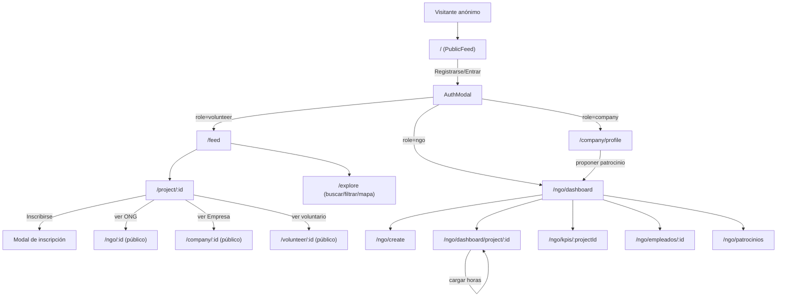

# FRONTEND_CONTEXT.md — VoluntariAR Web

> Detalle completo del frontend React/Vite. Leer junto con `PROJECT_CONTEXT.md §6-7` (navegación general y contrato con backend).

## 1. Arquitectura React

SPA de React 18 + React Router 7 (`createBrowserRouter`, data router API pero **sin usar `loader`/`action`** — toda la carga de datos ocurre en `useEffect` dentro de cada componente, al estilo "clásico"). No hay code-splitting (`lazy`) ni Suspense boundaries de datos. No hay gestor de estado global aparte de `AuthContext`; cada pantalla mantiene su propio estado con `useState`.

```
main.tsx
 └─ <StrictMode>
     └─ <AuthProvider>            (AuthContext.tsx)
         └─ <RouterProvider>       (routes.tsx)
             ├─ <Root/>            layout para "/", "/feed", "/explore", "/project/:id",
             │                     "/participation", "/notifications", "/profile", "/ngo/:id"
             │                     → <BottomNav/> + <AuthModal/>
             └─ <NGOLayout/>       layout para "/ngo/*" (dashboard, create, empleados, kpis, profile)
                                   → <NGOSidebarNav/> + <NGOBottomNav/> + <AuthModal/>
```

## 2. Organización de carpetas

```
frontend/src/
├── main.tsx                  # bootstrap: StrictMode + AuthProvider + RouterProvider
├── app/
│   ├── routes.tsx             # todas las rutas (createBrowserRouter)
│   └── components/            # 47 componentes .tsx (más sus *.test.tsx) — screens + layouts + widgets
├── lib/
│   ├── api.ts                 # cliente HTTP centralizado + TODOS los tipos TS de dominio (incluye api.posts y el helper de subida multipart)
│   ├── AuthContext.tsx        # sesión global (Context + Provider + hook useAuth)
│   ├── ChatContext.tsx        # chat en tiempo real (WebSocket)
│   ├── format.ts              # timeAgo/formatTime/parseBackendDate (aceptan ISO 8601 y el formato viejo sin zona), truncateText ("ver más"), userMessage (errores para el usuario) y otros formatos
│   ├── sponsorship.ts         # etiquetas y colores de los estados de un patrocinio
│   └── imageCompress.ts       # compresión de fotos en el navegador antes de subirlas (Momentos)
└── styles/
    ├── globals.css             # Tailwind + tema custom (design tokens) + fuentes
    └── (assets, fonts)
```

No existen carpetas `hooks/`, `services/`, `types/`, `utils/` separadas — todo vive en `lib/` (6 archivos) y `app/components/` (plano, sin subcarpetas por dominio).

## 3. Todas las páginas (rutas)

| Ruta | Componente | Layout | Rol requerido (solo backend) |
|---|---|---|---|
| `/` | `PublicFeed` | `Root` | Público (redirige si ya hay sesión) |
| `/feed` | `MainFeed` | `Root` | volunteer (feed de lo que sigue, vía `/api/follows/feed`) |
| `/explore` | `ExploreScreen` | `Root` | cualquiera logueado (búsqueda, filtros, mapa) |
| `/project/:id` (alias `/projects/:id`) | `ProjectDetails` | `Root` | público (con `optionalAuth`) |
| `/participation` | `MyParticipation` | `Root` | volunteer |
| `/notifications` | `NotificationsScreen` | `Root` | cualquiera logueado |
| `/momentos` | `MomentsPage` | `Root` | público (una ONG logueada es redirigida a `/ngo/momentos`) |
| `/messages` | `MessagesScreen` | `Root` | cualquiera logueado |
| `/messages/:userId` | `ChatThread` | `Root` | cualquiera logueado |
| `/profile` | `VolunteerProfile` | `Root` | volunteer |
| `/volunteer/:id` | `VolunteerPublicProfile` | `Root` | público |
| `/ngo/:id` | `NGOPublicProfile` | `Root` | público |
| `/company/:id` | `CompanyPublicProfile` | `Root` | público |
| `/ngo/dashboard` | `NGODashboard` | `NGOLayout` | ngo |
| `/ngo/create` | `CreateVoluntariado` | `NGOLayout` | ngo (guarda `RequireRole` en el layout, §97) |
| `/ngo/dashboard/project/:id` | `NGOProjectDetail` | `NGOLayout` | ngo |
| `/ngo/profile` | `NGOOwnProfile` | `NGOLayout` | ngo |
| `/ngo/patrocinios` | `NGOPatrocinios` | `NGOLayout` | ngo |
| `/ngo/momentos` | `NGOMoments` | `NGOLayout` | ngo (guarda `RequireRole` en el layout, §97) |
| `/ngo/empleados/:id` | `NGOEmpleados` | `NGOLayout` | ngo |
| `/ngo/kpis/:projectId` | `NGOKPIs` | `NGOLayout` | ngo |
| `/ngo/messages` | `MessagesScreen` | `NGOLayout` | ngo |
| `/ngo/messages/:userId` | `ChatThread` | `NGOLayout` | ngo |
| `/company/dashboard` | `CompanyDashboard` | `CompanyLayout` | company |
| `/company/profile` | `CompanyOwnProfile` | `CompanyLayout` | company |
| `/company/messages` | `MessagesScreen` | `CompanyLayout` | company |
| `/company/messages/:userId` | `ChatThread` | `CompanyLayout` | company |

`OnboardingScreen.tsx` (no enrutado) se borró en `PROJECT_ANALYSIS.md §99`, con OK del usuario.

## 4. Todos los componentes (49, sin contar `*.test.tsx`)

### Layouts / navegación
- `Root.tsx` — layout del lado "voluntario/público": `<Outlet/>` + `<BottomNav/>` + `<AuthModal/>` + `<ChatbotWidget/>`.
- `NGOLayout.tsx` — layout del lado "ONG": `<NGOSidebarNav/>` (desktop) + `<NGOBottomNav/>` (mobile) + `<Outlet/>` + `<AuthModal/>` + `<ChatbotWidget/>`.
- `CompanyLayout.tsx` — layout del lado "Empresa", mismo patrón que `NGOLayout` (`CompanySidebarNav`/`CompanyBottomNav`).
- `BottomNav.tsx` — navegación inferior mobile del lado voluntario.
- `NGOBottomNav.tsx` / `NGOSidebarNav.tsx` — navegación del lado ONG (mobile y desktop respectivamente).
- `CompanyBottomNav.tsx` / `CompanySidebarNav.tsx` — navegación del lado Empresa.
- `AuthModal.tsx` — modal de login/registro, controlado por estado global de `AuthContext` (`isAuthModalOpen`, `openAuthModal(mode)`). Único punto de entrada de autenticación en toda la app (no hay páginas `/login` o `/register` dedicadas). Redirige según rol al loguearse: `ngo`→`/ngo/dashboard`, `company`→`/company/profile`, `volunteer`→ se queda donde está.
- `ChatbotWidget.tsx` — botón flotante + panel del Chatbot FAQ, montado en los tres layouts.

### Pantallas — lado voluntario
- `PublicFeed.tsx` — feed público sin login, con CTA a registro; redirige automáticamente si detecta sesión activa.
- `MainFeed.tsx` — feed autenticado, arma la lista desde `/api/follows/feed` (lo que el voluntario sigue), no desde el catálogo completo. Si falla el feed de seguidos muestra el error con "Reintentar", no el estado vacío; si fallan las ONGs o "mis ONGs", la barra muestra el error de las sugerencias (§110).
- `ExploreScreen.tsx` — búsqueda, filtros (`FilterModal.tsx`) y mapa (`ProjectMap.tsx`) del catálogo completo de proyectos.
- `ProjectMap.tsx` — mapa con Leaflet (gratis, sin API key), pines custom con `L.divIcon`.
- `FilterModal.tsx` — modal de filtros (categoría, tipo, modalidad, costo) + función pura `filterProjects()` exportada, con tests.
- `ProjectDetails.tsx` — detalle de un proyecto: info completa, botón de inscripción, comentarios (distinguen si el autor participó, `is_participant`), calificación (solo si `my_enrollment_status === 'approved'`, con un formulario propio: no usa `ReviewsModal`). Reimplementa la blacklist de palabras del backend para validar comentarios en el cliente antes de enviarlos.
- `ProjectCard.tsx` — tarjeta reutilizada en feeds; incluye el modal de inscripción rápida.
- `FeedPostCard.tsx` — tarjeta de post para el feed vertical (like, comentar, inscribirse, calificar vía `ReviewsModal.tsx`).
- `FeedSidebar.tsx` — sidebar de escritorio del feed, puramente presentacional (recibe todo por props, incluidos `suggestionsError`/`onRetrySuggestions`: con error muestra el mensaje y "Reintentar" en vez de "¡Ya seguís a todas…!"; y `followError` (`{ ngoId, message }`, tipo `FollowNgoError`): el error de seguir se muestra debajo de esa ONG).
- `MyParticipation.tsx` — historial de inscripciones del voluntario logueado, con estado (pendiente/aprobada/rechazada) y horas acumuladas. "Reseña" (en las aprobadas) abre `ReviewsModal` con el formulario habilitado (§101).
- `VolunteerProfile.tsx` — perfil propio editable, incluyendo selección de habilidades (chips desde el catálogo `api.catalog.habilidades()` + nivel por habilidad, guardado vía `api.voluntarios.habilidades.update`). Si alguna carga falla muestra un aviso con "Reintentar" (recarga todo); cada parte que falló muestra "—" o "No se pudo cargar." en vez de 0 o del vacío, y si no cargaron mis habilidades o el catálogo, guardar el perfil no toca las habilidades (§109).
- `VolunteerPublicProfile.tsx` — perfil público de otro voluntario, con follow/unfollow (si falla, mensaje con `role="alert"` debajo del botón; §114) y sus listas de seguidores/seguidos (`FollowListModal`).
- `NotificationsScreen.tsx` — lista de notificaciones, marcar como leídas.

**Reseñas:** un solo componente, `ReviewsModal.tsx` (reseñas de otros + formulario si `canRate`). Lo usan el feed (`FeedPostCard`) y "Mis participaciones". Hasta `PROJECT_ANALYSIS.md §101` había además un `ReviewModal.tsx` que hacía lo mismo; se borró con OK del usuario. **Cada vez que se abre pide `GET /api/projects/:id`** (REVISION S3, §112): `initialRatings` solo se muestra mientras llega la respuesta (las reseñas del feed no traen `user_id`). Si la persona logueada ya calificó, el formulario se precarga con su reseña y el botón dice "Actualizar reseña" (S4; el backend hace upsert); mientras carga, el botón está deshabilitado. Un error de carga se ve con `InlineError` y "Reintentar" (S1, §107), y los errores tienen `role="alert"` (S10, §115).

### Pantallas — lado ONG
- `NGODashboard.tsx` — lista de proyectos propios + resumen de inscripciones pendientes por proyecto (una sola llamada agregada a `GET /api/ngos/me`, el N+1 que tenía antes ya se resolvió).
- `CreateVoluntariado.tsx` — formulario de alta/edición de proyecto (mismo componente sirve para crear y editar, diferenciado por `projectId` en query string). Pide modalidad (presencial/remoto/híbrido) y, según la modalidad, ubicación física y/o plataforma digital. Reimplementa validaciones de fecha/cupos/duración ya presentes en el backend.
- `NGOProjectDetail.tsx` — detalle de proyecto desde la óptica de la ONG: lista de inscriptos, aprobar/rechazar, cargar horas.
- `NGOOwnProfile.tsx` — perfil de la ONG editable (nombre, descripción, misión, ubicación, categoría).
- `NGOPublicProfile.tsx` — vista pública del perfil de una ONG (accesible sin login desde `/ngo/:id`), lista sus proyectos activos.
- `NGOPatrocinios.tsx` — propuestas de patrocinio de empresas sobre los proyectos propios: pendientes (aceptar/rechazar) e historial.
- `NGOEmpleados.tsx` — gestión de empleados/miembros del equipo de la ONG, con `api.ngos.empleados` (desde §98; antes `fetch` directo). Un error de carga se muestra con "Reintentar".
- `NGOKPIs.tsx` — CRUD completo (alta/edición/borrado) de indicadores de impacto por proyecto, con resumen visual. Usa `api.projects.kpis.*`.

### Pantallas — lado Empresa
- `CompanyDashboard.tsx` — panel de impacto: 4 KPIs (proyectos patrocinados, propuestas pendientes con contador de rechazadas, horas de voluntariado, voluntarios alcanzados) + lista de proyectos con badge de estado. Horas/voluntarios/cupos solo se muestran en patrocinios `aceptado`. Estado de error con "Reintentar". Usa `api.empresas.dashboard()` y los mapas de `lib/sponsorship.ts`. **No** es la ruta de aterrizaje tras el login (eso sigue siendo `/company/profile`, ver `AuthModal.tsx`).
- `CompanyOwnProfile.tsx` — perfil propio editable + lista de patrocinios propios (proponer, ver estado, retirar uno pendiente). Acepta **`?proponer=<projectId>`** (lo manda el botón "Patrocinar este proyecto" de `ProjectDetails`): abre "Proponer" con ese proyecto elegido y, si no vino en el listado, lo trae con `api.projects.get`; avisa si ya hay una propuesta vigente o si el proyecto no está activo. El listado pide `limit: 500` (sin `limit` el backend devuelve 20). `PROJECT_ANALYSIS.md §66`.
- `CompanyPublicProfile.tsx` — vista pública del perfil de una Empresa, accesible sin login desde `/company/:id`.

### Momentos (publicaciones con fotos) — ver la sección "Momentos" al final
- `MomentsPage.tsx` — `/momentos`: título + `FeedTabs` + `MomentsFeed`. Pública; al visitante le ofrece ingresar; a una ONG la redirige a `/ngo/momentos`; espera a que termine la verificación de sesión (`initializing`) para no parpadear.
- `NGOMoments.tsx` — `/ngo/momentos`, dentro del panel de la ONG (sin pestañas). Solo las publicaciones de los proyectos de **su** ONG: pide `api.ngos.me()` y le pasa `filters={{ ngo_id }}` a `MomentsFeed`; hasta tener el id no muestra el feed (sería el general), sino "Cargando momentos" o un `InlineError` con "Reintentar" (REVISION S2, §113).
- `MomentsFeed.tsx` — lista paginada (carga, vacío, error, "Ver más"), botón "Compartir un momento" y alta/borrado en la lista. Acepta `filters` (`project_id`/`user_id`/`ngo_id`) para las galerías de la Etapa 3 y los Momentos de la ONG.
- `PostCard.tsx` — una publicación: autor, proyecto, carrusel, me gusta optimista con rollback, borrar según `can_delete`, texto con "ver más".
- `PhotoCarousel.tsx` — carrusel (botones, flechas del teclado, deslizar con el dedo).
- `PostComposer.tsx` — modal para publicar (proyecto, hasta 5 fotos con vista previa, texto de hasta 500, compresión, aviso de fotos propias).
- `FeedTabs.tsx` — pestañas "Proyectos | Momentos" (son enlaces, no estado).
- `MomentsGrid.tsx` — grilla de miniaturas (`thumb_url`, 3 columnas, 9 por página) filtrada por `project_id` o `user_id`; al tocar una se abre la publicación completa (`PostCard`) en un modal. Misma paginación y recarga que `MomentsFeed`. Se usa en `ProjectDetails` (galería del proyecto) y `VolunteerPublicProfile` (por id de *usuario*).

### Chat
- `MessagesScreen.tsx` — lista de conversaciones (compartido entre voluntario, ONG y empresa).
- `ChatThread.tsx` — hilo de una conversación puntual: historial, envío (WS con fallback a REST), marcado automático de leído al abrir.

### Otros
- `ReviewsModal.tsx` — ver la nota de reseñas arriba.
- `LoadError.tsx` — estados de error de carga con "Reintentar"/"Volver" (`describeLoadError`); ver §12 y `PROJECT_ANALYSIS.md §64–§65`.
- `Modal.tsx` — modal común accesible (role="dialog", Escape, foco adentro y atrapado, foco devuelto, clic afuera, scroll bloqueado); ver §13 y `PROJECT_ANALYSIS.md §79`.
- `FollowListModal.tsx` — lista "Seguidores"/"Siguiendo" de un voluntario en un `<Modal>`. Recibe `mode`, `load(mode)` (qué endpoint pedir), `emptyText` por modo y `meId` (su fila va a `/profile` y dice "Tú"); pide la lista al abrir. La usan `VolunteerProfile` (mis listas) y `VolunteerPublicProfile` (las de ese voluntario); antes cada uno tenía su copia (`PROJECT_ANALYSIS.md §105`). Si el pedido falla, muestra el error con "Reintentar" (`InlineError` en `role="alert"`), nunca el texto de vacío (§108).

## 5. Hooks

No hay hooks custom (no existe `useX.ts` fuera de `useAuth` exportado por `AuthContext.tsx` y `useChat` exportado por `ChatContext.tsx`). Todo el "data fetching" se hace con `useEffect` + `useState` local, repetido componente a componente (patrón: `loading`, `error`, `data` como tres `useState` separados en casi cada pantalla).

## 6. Contexts

Dos contexts: `AuthContext` (`lib/AuthContext.tsx`) y `ChatContext` (`lib/ChatContext.tsx`).

```ts
interface AuthContextValue {
  user: User | null;
  token: string | null;
  loading: boolean;               // true mientras se revalida sesión al montar
  isAuthModalOpen: boolean;
  authModalMode: 'login' | 'register';
  login(email, password): Promise<void>;
  register(data): Promise<void>;
  logout(): void;
  openAuthModal(mode?): void;
  closeAuthModal(): void;
  updateUser(partial: Partial<User>): void;
}
```

- Al montar, si hay `v_token` en `localStorage`, llama a `GET /api/auth/me` (`initializing` en `true` mientras tanto). OK → usa ese usuario. **Solo cierra la sesión (borra `v_token` y `v_user`) si la respuesta es 401 (token inválido o vencido) o 404 (el usuario ya no existe)**; ante cualquier otro error (sin red, 5xx, el 502 de Render "dormido") conserva el token y sigue con el usuario guardado en `v_user` (`PROJECT_ANALYSIS.md §62`). Antes la cerraba ante cualquier error.
- `login`/`register` llaman a `api.auth.login`/`api.auth.register`, guardan en `localStorage` (`v_token`, `v_user`) y actualizan el estado.
- `logout` es puramente client-side: borra `localStorage` y el estado en memoria. **No invalida el token en el servidor** (no existe endpoint de logout/blacklist).

```ts
interface ChatContextValue {
  conversations: Conversation[];
  unreadTotal: number;
  connected: boolean;             // estado de la conexión de WebSocket
  refreshConversations(): void;
  onMessage(cb): () => void;      // suscripción a mensajes entrantes por WS
  sendViaSocket(to, body): boolean; // intenta mandar por WS; false si no hay conexión
}
```

- Montado en `main.tsx` **dentro** de `AuthProvider` (necesita `useAuth()` para saber cuándo abrir/cerrar el socket).
- Abre la conexión de WebSocket (`new WebSocket(...)`) cuando hay `user`+`token`, la cierra cuando no. Si se corta, reconecta con backoff (1 s, 2 s, 4 s, 8 s, tope 10 s), **salvo con el código 4001** (el servidor rechazó el token): ahí no reintenta (`PROJECT_ANALYSIS.md §71`). La URL se deriva de `BASE` (la misma constante que usa el cliente REST) reemplazando `/api` por `/ws` y `http` por `ws`.
- Mantiene `conversations` refrescándose vía `GET /api/messages/conversations` cada vez que llega un mensaje nuevo por WS, y expone `unreadTotal` (suma de no leídos) para los badges de navegación.
- `onMessage(cb)` permite que `ChatThread.tsx` se suscriba a mensajes entrantes sin que `ChatContext` necesite saber en qué hilo está parado el usuario — el componente filtra por `sender_id`/`receiver_id` él mismo.

## 7. Servicios / API (`lib/api.ts`)

Cliente HTTP centralizado, sin dependencias externas (fetch nativo). Estructura:

```ts
const API_URL = import.meta.env.VITE_API_URL;

async function request(path, options) {
  const token = localStorage.getItem('v_token');
  const res = await fetch(`${API_URL}${path}`, {
    headers: { 'Content-Type': 'application/json',
               ...(token && { Authorization: `Bearer ${token}` }) },
    ...options,
  });
  return readJson(res); // ver abajo
}

// readJson (también lo usa upload()): el cuerpo se lee con res.json().catch(): un proxy puede devolver
// HTML. Si !res.ok → throw new ApiError(data?.error || fallback, res.status), donde fallback es
// "El servidor no está disponible…" para 502/503/504 y "Error del servidor" para el resto. Si es OK pero
// no es JSON → ApiError("Respuesta inesperada del servidor"). Un fallo de red sigue siendo el TypeError
// de fetch (lo traduce userMessage() de format.ts). §62.

export const api = {
  auth: { register, login, me, updateMe },
  projects: { list, get, create, update, remove, comment, rate, kpis, recommended... },
  enrollments: { enroll, byProject, byVolunteer, approve, reject, logHours },
  ngos: { list, get, me, updateMe, employees, patrocinios: { list, decide }... },
  empresas: { me, get, update, dashboard, patrocinios: { list, propose, withdraw } },
  follows: { ngo, project, volunteer, feed... },
  faqs: { list, ask },
  notifications: { list, markRead },
};
```

Todos los tipos de dominio (`User`, `Project`, `NGO`, `Empresa`, `Enrollment`, `Notification`, `Faq`, `Patrocinio`, etc.) están definidos como `interface` en este mismo archivo — no hay un módulo `types/` separado.

**Componentes que rompen este patrón:** ninguno desde §98 (el último era `NGOEmpleados.tsx`).

## 8. Modelos TypeScript (resumen — ver `api.ts` para el detalle campo por campo)

| Interface | Corresponde a |
|---|---|
| `User` | fila de `users` (id, name, email, role, created_at) |
| `Project` | proyecto formateado por `fmt()` del backend — incluye `roles: string[]`, `requirements: string[]`, `category?: string`, `latitude?/longitude?`, `modality?`, `my_enrollment?: Enrollment` |
| `NGO` | ONG formateada por `fmtNgo()` — incluye `category?: string` |
| `Empresa` | Empresa formateada por `fmtEmpresa()` — incluye `category?/industry?` |
| `Enrollment` | inscripción: `id, project_id, volunteer_id, status, message?, hours_logged, created_at` |
| `Notification` | `id, user_id, type, content, read, created_at` |
| `Faq` | `id, categoria?, pregunta, respuesta` |
| `Patrocinio` | propuesta de patrocinio Empresa↔Proyecto: `empresa_id, project_id, estado, mensaje?, aporte, ...` |
| `CompanyDashboard` | respuesta de `GET /api/empresas/me/dashboard`: `stats`, `impact`, `projects: CompanyDashboardProject[]` (claves en inglés; `sponsorship_status` reusa los valores de `Patrocinio['estado']`) |

## 9. Flujo de navegación (detalle por rol)


```mermaid
flowchart TD
    Start["Visitante anónimo"] --> PF["/ (PublicFeed)"]
    PF -->|Registrarse/Entrar| Modal["AuthModal"]
    Modal -->|role=volunteer| MF["/feed"]
    Modal -->|role=ngo| ND["/ngo/dashboard"]
    Modal -->|role=company| CP["/company/profile"]

    MF --> PD["/project/:id"]
    MF --> EX["/explore (buscar/filtrar/mapa)"]
    PD -->|Inscribirse| EnrollModal["Modal de inscripción"]
    PD -->|ver ONG| NPP["/ngo/:id (público)"]
    PD -->|ver Empresa| CPP["/company/:id (público)"]
    PD -->|ver voluntario| VPP["/volunteer/:id (público)"]

    ND --> CV["/ngo/create"]
    ND --> NPD["/ngo/dashboard/project/:id"]
    NPD -->|aprobar/rechazar inscriptos| NPD
    NPD -->|cargar horas| NPD
    ND --> NKPI["/ngo/kpis/:projectId"]
    ND --> NEmp["/ngo/empleados/:id"]
    ND --> NPat["/ngo/patrocinios"]

    CP -->|proponer patrocinio| ND
```

## 10. Flujo de autenticación (frontend)

1. Usuario abre `AuthModal` (login o registro) desde cualquier pantalla.
2. Al submit, `AuthContext.login()`/`register()` llama a `api.auth.*`.
3. Éxito → `localStorage.setItem('v_token', ...)`, `setUser(...)`, `closeAuthModal()`.
4. Componentes como `AuthModal` observan `user` vía `useAuth()` y redirigen automáticamente con `navigate()` en un `useEffect` cuando detectan sesión: `ngo`→`/ngo/dashboard`, `company`→`/company/profile`, `volunteer` se queda donde está (normalmente `/`, que ya muestra el feed público).
5. Error → el modal muestra `err.message` (el string ya viene en español desde el backend).

No hay persistencia de "a dónde volver" tras el login — siempre redirige a la home del rol, perdiendo el contexto de si el usuario estaba intentando inscribirse a un proyecto específico.

## 11. Estado global

Limitado a `AuthContext`. No hay estado global de UI (temas, filtros persistentes, carrito, etc.) — cada pantalla resetea sus filtros al desmontar/montar.

## 12. Manejo de errores

- Sin *error boundary* de React en ningún nivel — un throw no capturado en render rompe la pantalla completa (pantalla en blanco), no solo un componente.
- Cada componente atrapa errores de `fetch`/`api.*` con `try/catch` local y los muestra con un `useState<string|null>` propio, normalmente renderizado como texto rojo inline — no hay un sistema de toasts/notificaciones de error.
- **Pantallas que cargan un recurso por id** (`ProjectDetails`, `NGOPublicProfile`, `CompanyPublicProfile`, `NGOProjectDetail`): si la carga falla, muestran **`<LoadError />`** (`components/LoadError.tsx`), nunca `navigate(-1)` + `return null` (abiertas desde un link compartido quedaban en blanco, `PROJECT_ANALYSIS.md §64`). `describeLoadError(err, textoNoExiste)` decide el mensaje: 404 → "no existe" sin reintentar; 403 → mensaje del servidor sin reintentar; 5xx o sin red → con "Reintentar". "Volver" solo aparece si hay página anterior (`history.state.idx > 0`); si no, "Ir al inicio". Una pantalla nueva de ese tipo tiene que usarlo.
- **Listados y secciones de un panel** (`NGOPatrocinios`, `NGODashboard`, `NGOKPIs`, `NotificationsScreen`, patrocinios de `CompanyOwnProfile`, `FollowListModal`, `VolunteerProfile` (un aviso general para sus seis cargas), `MainFeed` (feed y sugerencias), `ExploreScreen` (con error no dibuja el mapa; si fallan las recomendaciones avisan dentro de "Para vos" con su propio "Reintentar" y el catálogo se ve igual, §111)): si la carga falla muestran **`<InlineError />`** (mismo archivo, mensaje + "Reintentar"), **nunca el estado vacío**: antes un error se veía como "Sin notificaciones" o "Todavía no hay patrocinios" (`§65`). Si una acción falla (decidir un patrocinio, retirar una propuesta, marcar como leídas), el mensaje se muestra con `role="alert"`. `NGODashboard` va al inicio solo con un 401 (`ApiError.status`), ya no buscando "Token" en el texto.
- **Seguir/dejar de seguir** (perfiles públicos de voluntario y ONG, tarjeta del feed, sugerencias de Inicio): si falla, mensaje breve con `role="alert"` junto al botón, con `userMessage(err, FOLLOW_ERROR)` (`lib/format.ts`), y el estado queda como estaba (`PROJECT_ANALYSIS.md §114`).
- No hay reintento automático. Manejo de 401: `AuthContext` al recargar (§62) y `NGODashboard` (por `ApiError.status`, §65).

## 13. Convenciones de componentes

- Cada componente es un archivo `.tsx` con export nombrado (no default), nombrado igual que el archivo.
- Sin `React.memo`, sin `useCallback`/`useMemo` — no hay optimizaciones de re-render (razonable dado el tamaño de la app).
- Sin PropTypes ni `interface Props` compartida — cada componente define su propio `Props` inline si recibe alguna (la mayoría son "screen-level" y no reciben props, solo leen `useParams()`/`useAuth()`).

- **Modales: usar `<Modal>`** (`components/Modal.tsx`), nunca un `<div className="fixed inset-0">` propio. Pasarle un nombre (`labelledBy` con el id del título, o `label`) y las clases de fondo/panel; Escape, foco y Tab ya los resuelve. Lo usan **todos** los modales: `AuthModal`, `ReviewModal`, `ReviewsModal`, `FilterModal`, el mapa ampliado de `ProjectMap`, `PostComposer`, el visor de `MomentsGrid` y las listas de seguidores (`FollowListModal`, que usan `VolunteerProfile`/`VolunteerPublicProfile`) (`PROJECT_ANALYSIS.md §79`, `§81` y `§105`). No agregar listeners de Escape en `window`: cerrarían también el modal de abajo cuando hay dos abiertos. Si cerrar puede perder datos (`PostComposer`, el visor de `MomentsGrid`), `closeOnOverlay={false}` y que `onClose` pase por la confirmación. `FilterModal` y `ProjectMap` lo envuelven en `createPortal` (z-index sobre Leaflet). `ChatbotWidget` no es modal (panel flotante): `role="dialog"` sin `aria-modal`, Escape y foco propios.
- **Nombres accesibles (`PROJECT_ANALYSIS.md §80`):** todo botón que solo muestra un ícono lleva `aria-label` ("Cerrar", "Volver", "Enviar mensaje"…); si actúa sobre un ítem de una lista, el nombre dice cuál (`Aprobar a ${nombre}`, `Editar KPI ${nombre}`). Los botones que alternan un estado usan `aria-pressed` con nombre fijo ("Mostrar contraseña", las estrellas: "3 estrellas"). Todo `input`/`select`/`textarea` lleva `aria-label` con el **mismo texto que su etiqueta visible** (los `<p>`/`<label>` de arriba no están asociados), o uno que diga su función si no tiene etiqueta; el `placeholder` no cuenta como etiqueta. `A11yNames.test.tsx` lo controla pantalla por pantalla: una pantalla nueva con formularios o íconos se suma ahí.
- **Respuestas viejas (`PROJECT_ANALYSIS.md §83`):** si un `useEffect` carga datos según un parámetro que puede cambiar sin desmontar la pantalla (`:id`/`:userId` de la URL, una categoría, una búsqueda), la respuesta de un pedido anterior no puede pisar a la del actual. En el effect: `let cancelled = false`, `if (!cancelled)` antes de cada `set…` (también en `catch` y `finally`) y `return () => { cancelled = true; }` (como `ChatThread`, `VolunteerPublicProfile`, `PostComposer`). Si la carga se dispara desde varios lugares (el effect, "Reintentar", recargar tras una acción), `useLatestRequest()` (`lib/useLatestRequest.ts`): `const req = latest.start()` y `if (latest.isLatest(req))` antes de cada `set…` (también en `catch` y `finally`). Lo usan `PublicFeed`, `ProjectDetails`, `NGOPublicProfile`, `CompanyPublicProfile`, `NGOProjectDetail`, `NGOKPIs` y `NGOEmpleados` (§89). Los indicadores de carga llevan `role="status"` con nombre.

## 14. Convenciones de estilos

- Tailwind CSS 4 utilitario, clases inline en el JSX (no hay CSS Modules ni styled-components).
- `styles/globals.css` define variables de tema (colores, radios, fuentes) como custom properties CSS, consumidas por las clases de Tailwind vía `@theme` (Tailwind 4).
- Iconografía consistente con `lucide-react`.
- No hay un sistema de componentes UI compartido (no hay `Button.tsx`, `Card.tsx`, `Input.tsx` genéricos) — cada pantalla reescribe sus propios `<button className="...">` con las mismas clases repetidas copy-pasteadas. Esto es consistente con el origen "Figma-to-code" del proyecto (ver `PROJECT_CONTEXT.md §11`).

## 15. Problemas detectados

1. ~~**`OnboardingScreen.tsx` no está enrutado**~~ — borrado en §99.
2. ~~**`NGOEmpleados.tsx` evita `api.ts`**~~ — **resuelto en `PROJECT_ANALYSIS.md §98`**: usa `api.ngos.empleados`.
3. ~~**Dos componentes de reseña que hacen lo mismo**~~ — consolidados en `ReviewsModal` (§101).
4. ~~**Sin guardas de rol/ruta en el frontend**~~ — **resuelto en `PROJECT_ANALYSIS.md §97`**: `NGOLayout` y `CompanyLayout` envuelven todo en `<RequireRole role=…>` (`components/RequireRole.tsx`). Mientras se verifica la sesión, "cargando"; sin sesión, al inicio con el login abierto; con otro rol, al inicio de ese rol (`homeFor`). Al cerrar sesión desde el panel no se abre el login. Es solo experiencia de uso: la autorización sigue en el backend (regla 15).
5. **Sin paginación real en `ExploreScreen.tsx`**: pide el catálogo completo con un `limit` alto fijo (`200`) en vez de "cargar más"/scroll infinito — funciona hoy, pero no escala indefinidamente si el catálogo de proyectos crece mucho. Ver `PROJECT_ANALYSIS.md §29` bug 4.
6. **Validaciones duplicadas** (regex de email/password/nombre en `AuthModal.tsx`, lista de palabras en `lib/badWords.ts`, con su igualdad controlada por un test del backend desde §93) que deben mantenerse sincronizadas con el backend.
7. **Sin manejo centralizado de expiración de sesión** — un 401 en medio de la navegación no redirige consistentemente al login en todas las pantallas.
8. **Componentes sin test propio** (sin `<Componente>.test.tsx`; 30 de 49 al 2026-10-15). Algunos tienen tests de un aspecto puntual en otro archivo (entre paréntesis): `BottomNav`, `ChatThread`, `CompanyBottomNav`, `CompanyLayout`, `CompanySidebarNav`, `CreateVoluntariado`, `ExploreScreen`, `FeedPostCard`, `FeedSidebar`, `FollowListModal` (`FollowLists`), `MainFeed` (`FeedTabsPlacement`), `MessagesScreen`, `MyParticipation`, `NGOBottomNav`, `NGODashboard` (`SwallowedErrors`), `NGOEmpleados`, `NGOLayout` (`routes`), `NGOOwnProfile`, `NGOProjectDetail` (`LoadErrorScreens`, `MomentsPlacement`), `NGOPublicProfile` (`LoadErrorScreens`, `routes`), `NotificationsScreen` (`NotificationsTime`, `SwallowedErrors`), `ProjectDetails` (`EnrollStatusLabel`, `NgoPanelLink`, `SponsorPreselect`, `LoadErrorScreens`, `MomentsPlacement`), `ProjectMap`, `PublicFeed` (`FeedTabsPlacement`), `ReviewModal`, `ReviewsModal`, `Root` (`routes`), `VolunteerProfile` (`FollowLists`), `VolunteerPublicProfile` (`MomentsPlacement`, `FollowLists`). Los de más riesgo sin tests de su lógica: `NGOProjectDetail` (aprobar, horas), `CreateVoluntariado`, `MyParticipation`, `NGOEmpleados`.

## 16. Posibles mejoras

- Extraer un hook `useApi()`/`useFetch()` genérico (loading/error/data) para eliminar la repetición de los tres `useState` en cada pantalla.
- ~~Agregar un componente `<ProtectedRoute role="ngo">`~~ — hecho como `RequireRole` (§97).
- Crear una pequeña librería de componentes UI compartidos (`Button`, `Input`, `Card`, `Spinner`, `ErrorBanner`) para reducir la duplicación de clases Tailwind.
- ~~Migrar `NGOEmpleados.tsx` a `api.ts`~~ — hecho (§98).
- ~~Consolidar `ReviewModal.tsx` y `ReviewsModal.tsx`~~ — hecho (§101).
- Agregar un `ErrorBoundary` de React a nivel de cada layout (`Root`, `NGOLayout`, `CompanyLayout`) para evitar pantallas en blanco ante errores no capturados.
- ~~Registrar o eliminar `OnboardingScreen.tsx`~~ — eliminado (§99).
- Sumar tests para los componentes grandes listados en el problema 8.

## Momentos (publicaciones con fotos) — estado del frontend
> **Etapas 2 y 3 completas** (`PROJECT_ANALYSIS.md §43`, `§46`, `§47` y `§48`). Queda verificar una subida real a Cloudinary.

**Cómo se llega:** voluntarios y visitantes, con la pestaña **Momentos** de `FeedTabs` (en `MainFeed` y en `PublicFeed`) → `/momentos`. La ONG **no** tiene pestañas: entra por "Momentos" en su barra lateral (escritorio) o por el botón "Momentos" del header de `NGODashboard` (celular) → `/ngo/momentos`. **No se agregó un ítem a las barras inferiores** (la del voluntario ya tiene 5, la de la ONG también). Hoy, en `/momentos`, ningún ítem de la barra del voluntario queda resaltado (el de "Inicio" solo se marca en `/feed`).

**Piezas:**
- **`api.posts`** (`lib/api.ts`): `list`, `get`, `eligibleProjects`, `create`, `like`, `unlike`, `remove` y los tipos `Post`, `PostPhoto`, `PostsPage`, `PostFilters` (`project_id`, `user_id`, `ngo_id`: el id de la tabla `ngos`, no el del usuario), `EligibleProject`. `create` usa un helper aparte (`upload`) que **no fija `Content-Type`**: `req()` fuerza `application/json` y con eso el servidor nunca recibiría los archivos del multipart.
- **`lib/imageCompress.ts`**: `compressImage(file)` reduce a 1600 px, recodifica como JPEG (0,82), fondo blanco para PNG transparentes, no toca fotos chicas y livianas, y falla con mensajes para el usuario. Los límites (tipos y 8 MB) deben coincidir con `backend/src/routes/posts.js`.
- **`lib/format.ts`**: `FOLLOW_ERROR` (respaldo común del mensaje de seguir/dejar de seguir, §114). `formatDateOnly` (fechas sin hora "YYYY-MM-DD", p. ej. la de un KPI: se arman como fecha **local**, nunca `new Date("YYYY-MM-DD")`, que es medianoche UTC y en Córdoba cae el día anterior; `§63`). `timeAgo` y `formatTime` (hora del chat): las dos pasan por `parseBackendDate`, aceptan ISO (con o sin zona) y el formato viejo, y devuelven `""` si no es una fecha. Toda fecha del backend se parsea con `parseBackendDate`, nunca con `new Date(x + "Z")` (`PROJECT_ANALYSIS.md §46`, `§53`); `truncateText(texto, max, maxLines)` ("ver más": corta por caracteres y por líneas, en límite de palabra) y `userMessage(err, respaldo)` (muestra el mensaje del servidor, que viene en español, salvo un `TypeError` de red, que se reemplaza).
- **Componentes:** ver la lista en la sección 4.

**Reglas de comportamiento que importan (cada una tiene su test):**
- **`can_delete` manda el servidor.** `PostCard` muestra el botón de borrar solo si `post.can_delete`; el cliente no deduce nada (conoce el id del autor, no quién es la ONG dueña). Comparar `user.id === author.id` se usa **solo** para elegir el texto de la confirmación.
- **`post.author.id` es el id del *usuario*.** Solo los voluntarios tienen perfil público (`/volunteer/:id`); el nombre de una ONG no se enlaza.
- **Me gusta optimista:** cambia la pantalla al instante, se ajusta al número del servidor y, si falla, se revierte y avisa. Con un pedido en vuelo se ignoran los toques nuevos. Sin sesión abre el modal de ingreso y no llama a la API.
- **Paginación (`MomentsFeed`):** `offset` = lo que el servidor *devolvió* (no lo que se muestra); se deduplica por id; borrar una publicación del feed resta 1 al offset y publicar una suma 1; una publicación nueva que no corresponde al filtro (otro proyecto/autor) no se agrega (con `ngo_id` no se puede comprobar porque el post no trae la ONG; se agrega, y hoy solo lo usa `NGOMoments`, donde la ONG solo publica en sus proyectos); una respuesta vieja que llega tarde (cambio de filtro) se descarta.
- **El feed recarga cuando cambia el *id* del usuario** (no su objeto): `liked_by_me` y `can_delete` los calcula el servidor según quién mira, y un visitante puede iniciar sesión desde el modal sin salir de la pantalla.
- **Compositor:** tope de 5 fotos y de 500 caracteres; la compresión corre al publicar y, si una foto falla, no se sube nada y se conserva el formulario; tras publicar el botón queda bloqueado hasta que `MomentsFeed` cierra el modal (evita publicar dos veces); pregunta antes de descartar si hay fotos o texto.

**Etapa 3:** `ProjectDetails` y `VolunteerPublicProfile` muestran `MomentsGrid`; `NGOProjectDetail` muestra `MomentsFeed` del proyecto **sin compositor** (`showComposer={false}`), y el botón de borrar le aparece en cualquier publicación porque el servidor manda `can_delete`. Límite: el modal de `MomentsGrid` guarda una copia de la publicación; si se da me gusta dentro del modal y se cierra y reabre, la tarjeta muestra el estado anterior hasta recargar (por lectura del código; sin test).

**Verificado por Matías en local (`PROJECT_ANALYSIS.md §49`):** la subida real a Cloudinary. **Sin verificar:** cómo se ve todo (Tailwind), el deslizar con el dedo en un celular real, el foco/teclado del modal (no hay *focus trap*) y todo lo anterior en producción (Render).
