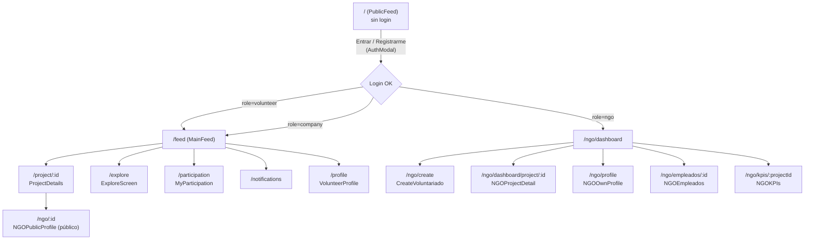

# PROJECT_CONTEXT.md — VoluntariAR

> Documento maestro de contexto. Leer este archivo primero en cualquier conversación nueva sobre este proyecto. Los archivos `BACKEND_CONTEXT.md`, `FRONTEND_CONTEXT.md`, `DATABASE_CONTEXT.md` y `API_CONTEXT.md` profundizan cada capa; `PROJECT_ANALYSIS.md` contiene el diagnóstico crítico; `AI_RULES.md` define cómo debe trabajar una IA sobre este código.

## 1. Descripción del proyecto

**VoluntariAR** es una plataforma web tipo "red social solidaria" — un proyecto académico (Universidad Católica de Córdoba, Argentina) que conecta:

- **Voluntarios** que buscan participar en proyectos sociales.
- **ONGs** que publican esos proyectos y gestionan inscripciones.
- **Empresas** que, conceptualmente, patrocinan voluntariados corporativos (RSE) — este rol existe en el modelo de datos y en el registro, pero **no tiene pantallas propias implementadas** (ver §7 y `PROJECT_ANALYSIS.md`).

El feed público (`/`) permite a cualquier visitante no autenticado explorar proyectos activos antes de crear una cuenta.

## 2. Objetivo del sistema

Facilitar el descubrimiento y la gestión de oportunidades de voluntariado: que una ONG pueda publicar un proyecto con cupos, requisitos y roles, que un voluntario pueda inscribirse y hacer seguimiento de su participación (incluidas horas realizadas), y que la ONG pueda aprobar/rechazar inscripciones, medir impacto con KPIs y administrar su equipo interno.

## 3. Arquitectura general

Monorepo con dos paquetes npm independientes (`frontend/`, `backend/`) más un `render.yaml` en la raíz para despliegue automático en Render.com (Blueprint).

```
┌──────────────────────────────┐
│  Frontend — React 18 SPA     │
│  Vite + React Router 7        │
│  Tailwind CSS 4                │
│  AuthContext (JWT en localStorage) │
│  src/lib/api.ts → fetch()      │
└───────────────┬────────────────┘
                │ HTTP/JSON (REST)
                ▼
┌──────────────────────────────┐
│  Backend — Express 4 (Node)   │
│  CORS → express.json()         │
│  Middleware JWT (auth.js)      │
│  Rutas: /api/auth /projects    │
│  /enrollments /ngos /notifications │
│  /categorias /roles /habilidades │
└───────────────┬────────────────┘
                │ SQL (adaptador dual)
                ▼
┌──────────────────────────────┐
│  Base de datos                 │
│  SQLite (local, better-sqlite3)│
│  PostgreSQL (prod, Render)     │
│  24 tablas · 18 índices        │
└──────────────────────────────┘
```

No hay backend-for-frontend, GraphQL, ni capa de caché: es un CRUD REST clásico servido directamente por Express, consumido por un SPA de React.

## 4. Stack tecnológico

### Frontend
| Tecnología | Versión | Uso |
|---|---|---|
| React | 18.3 | UI, con `StrictMode` |
| React Router | 7.13 | Enrutamiento SPA (`createBrowserRouter`) |
| Vite | 6.3 | Bundler / dev server |
| Tailwind CSS | 4.1 (via `@tailwindcss/vite`) | Estilos utilitarios inline |
| lucide-react | 0.487 | Íconos |
| TypeScript | (vía Vite, `tsconfig.json` con `strict: true`) | Tipado — con `noUnusedLocals`/`noUnusedParameters` desactivados |

No usa: gestor de estado global (Redux/Zustand — todo vive en `AuthContext` + estado local por componente), React Query/SWR (fetch manual en cada `useEffect`), testing framework, linter configurado en el repo.

### Backend
| Tecnología | Versión | Uso |
|---|---|---|
| Node.js | ≥18 (`engines` en package.json) | Runtime |
| Express | 4.19 | Framework HTTP |
| jsonwebtoken | 9.0 | Autenticación JWT |
| bcryptjs | 2.4 | Hash de contraseñas |
| better-sqlite3 | 9.6 | Driver SQLite síncrono (local) |
| pg | 8.12 | Driver PostgreSQL (producción) |
| cors | 2.8 | CORS configurable por `CORS_ORIGINS` |
| multer | 1.4 | Dependencia declarada pero **no usada en ninguna ruta** (ver `PROJECT_ANALYSIS.md`) |
| uuid | 10.0 | Dependencia declarada pero **no usada** — los IDs se generan con SQL (`gen_random_uuid()` / `randomblob`), no con la librería `uuid` de Node |
| nodemon | 3.1 | Dev only, hot-reload |

No usa: ORM (todo es SQL crudo con parámetros posicionales `$1, $2...`), sistema de migraciones versionado (un único script `migrate.js` idempotente con `CREATE TABLE IF NOT EXISTS`), tests, linter.

### Base de datos
- **Local:** SQLite, archivo `backend/data/voluntariar.sqlite` (creado automáticamente, con WAL habilitado).
- **Producción:** PostgreSQL, gestionado por Render (plan free, expira a los 90 días).
- El adaptador (`backend/src/db/index.js`) decide en tiempo de arranque cuál usar según `USE_POSTGRES` / presencia de `DATABASE_URL`, y traduce sobre la marcha la sintaxis específica de Postgres a SQLite (ver `BACKEND_CONTEXT.md §2`).

## 5. Roles del sistema

| Rol (`users.role`) | Descripción | Pantallas dedicadas |
|---|---|---|
| `volunteer` | Explora proyectos, se inscribe, ve su historial y horas, comenta, califica | Sí (feed, explorar, participaciones, perfil, notificaciones) |
| `ngo` | Publica y gestiona proyectos, aprueba/rechaza inscripciones, gestiona empleados y KPIs | Sí (dashboard, crear, detalle de proyecto, perfil, empleados, KPIs) |
| `company` | Pensado para patrocinar voluntariados (RSE) | **No** — se registra y hace login, pero es redirigido al feed de voluntario (`/feed`); no hay dashboard de empresa, ni endpoints que usen `empresa_voluntariados` desde el frontend |

El rol se fija en el registro y es inmutable desde la UI (no hay endpoint de cambio de rol).

## 6. Flujo completo de navegación



Hay **dos layouts raíz** (`Root.tsx` para `/` y `NGOLayout.tsx` para `/ngo/*`), cada uno con su propia navegación (bottom nav en mobile, sidebar en desktop) y su propio `<AuthModal/>` montado.

`OnboardingScreen.tsx` es un componente de login/registro alternativo **que existe en el código pero no está registrado en `routes.tsx`** — no es alcanzable navegando la app (ver `PROJECT_ANALYSIS.md`).

## 7. Cómo interactúan frontend y backend

- El frontend llama a la API vía `src/lib/api.ts`, un cliente `fetch` centralizado que añade automáticamente el header `Authorization: Bearer <token>` si hay sesión (token guardado en `localStorage` bajo la clave `v_token`).
- **Excepción importante:** tres componentes (`NGOKPIs.tsx`, `NGOEmpleados.tsx`) **no usan `api.ts`** — hacen `fetch()` directo a `import.meta.env.VITE_API_URL`, leyendo el token de `localStorage` por su cuenta. Esto duplica lógica y significa que cualquier cambio futuro al cliente HTTP (p. ej. manejo de errores, refresh de token) no cubre estos dos módulos automáticamente.
- El backend responde siempre JSON. Los errores se devuelven como `{ error: "mensaje en español" }` con el código HTTP correspondiente; el cliente los relanza como `Error(data.error)` y cada componente los muestra en su propio estado local (no hay un manejador de errores global en el frontend).
- No hay renovación de token ni interceptor de 401: si el JWT expira, la próxima request falla y el componente que la hizo debe manejarlo manualmente (algunos lo hacen — `NGODashboard` redirige a `/` si detecta "Token"/"autenticado" en el mensaje de error —, la mayoría no).

## 8. Organización del repositorio

```
voluntariar-v2/
├── render.yaml              # Blueprint de Render: define los 3 servicios (api, frontend, db)
├── README.md                 # Documentación funcional/deploy orientada a humanos
├── backend/
│   ├── src/
│   │   ├── index.js          # Entry point Express: CORS, rutas, 404, error handler
│   │   ├── db/index.js       # Adaptador SQLite/PostgreSQL (dual)
│   │   ├── middleware/auth.js # requireAuth, optionalAuth, requireRole, signToken
│   │   └── routes/
│   │       ├── auth.js       # register, login, me (GET/PUT)
│   │       ├── projects.js   # CRUD proyectos, comments, ratings, kpis
│   │       ├── enrollments.js # inscripciones, aprobación, horas
│   │       ├── ngos.js       # perfil ONG, dashboard, empleados
│   │       └── notifications.js
│   ├── scripts/
│   │   ├── migrate.js        # DDL completo (24 tablas + 18 índices + datos base)
│   │   └── seed.js           # Datos de demo (usuarios, ONGs, 12 proyectos)
│   └── data/voluntariar.sqlite # DB local (generada, no versionar en git real)
└── frontend/
    └── src/
        ├── app/
        │   ├── routes.tsx    # Definición de rutas (createBrowserRouter)
        │   └── components/   # 22 componentes, todos "screen-level" o cercanos
        ├── lib/
        │   ├── api.ts        # Cliente HTTP + todos los tipos TS del dominio
        │   └── AuthContext.tsx # Estado global de sesión (React Context)
        └── styles/           # CSS global + Tailwind + fuentes + tema
```

No hay separación entre "componentes de presentación" y "componentes contenedores": cada archivo en `components/` es autosuficiente (fetch + estado + UI). No hay carpeta `hooks/` custom, ni `types/` separada de `api.ts`.

## 9. Convenciones generales

- **Idioma mixto por diseño:** los nombres de tabla/columna de base de datos y buena parte de las variables del backend están en **español** (`titulo`, `descripcion`, `ubicacion`, `cupos`, `mensaje`, `foto_perfil`...), mientras que el **frontend y sus tipos TypeScript están en inglés** (`title`, `description`, `location`, `volunteers_needed`, `message`, `image`...). El puente entre ambos mundos son funciones `fmt()` / `fmtNgo()` en las rutas del backend que renombran campos al responder. Esto es una convención deliberada pero frágil: cualquier campo nuevo debe agregarse a mano en el `fmt()` correspondiente o el frontend no lo verá.
- **IDs:** todas las tablas usan claves primarias de tipo `TEXT` (UUID), generadas por la base de datos (`gen_random_uuid()` en Postgres, expresión `randomblob` en SQLite) — excepto en `seed.js`, que inserta IDs legibles a mano (`user-vol-1`, `ngo-1`, etc.) para facilitar las credenciales de demo.
- **Parámetros SQL:** siempre posicionales estilo Postgres (`$1, $2, ...`), incluso en las queries que corren contra SQLite — el adaptador los traduce a `?` internamente.
- **Fechas:** `CURRENT_TIMESTAMP` (Postgres) / `datetime('now')` (SQLite), abstraído por la constante `NOW` en `migrate.js`.
- **Errores HTTP:** el backend nunca expone stack traces al cliente; usa `try/catch` por endpoint con mensajes de error en español pensados para mostrarse directo en la UI.

## 10. Decisiones de diseño relevantes

- **SQLite en local, Postgres en producción** con un único adaptador que traduce sintaxis sobre la marcha (no dos codebases separados). Ahorra fricción para levantar el proyecto localmente sin instalar Postgres, a costa de una capa de traducción regex que es una fuente de bugs sutiles (ver `BACKEND_CONTEXT.md §2` y `PROJECT_ANALYSIS.md`).
- **JWT sin refresh token:** sesiones de 7 días (`JWT_EXPIRES_IN`), sin blacklist ni rotación. Cerrar sesión es puramente client-side (se borra el token de `localStorage`); el token sigue siendo válido en el servidor hasta que expira.
- **Sin ORM:** todas las queries son SQL crudo escrito a mano. Da control total sobre el SQL pero significa que no hay validación de esquema en tiempo de desarrollo ni migraciones incrementales versionadas — el "esquema" vive enteramente en `migrate.js`, que además funciona por `CREATE TABLE IF NOT EXISTS` (agregar una columna a una tabla existente requiere una migración manual nueva, no solo editar el `CREATE TABLE`).
- **Requisitos/roles de proyecto normalizados en tablas propias** (`requisitos`, `roles`, `project_roles`) en vez de columnas JSON — explícitamente mencionado en un comentario del código (`REQUISITOS — tabla normalizada (reemplaza JSON)`), pero el propio backend expone estos datos al frontend serializados como JSON string (`roles_json`, `requisitos_json`) que luego se parsean de nuevo con `JSON.parse` — un patrón híbrido.
- **Feed público sin autenticación** (`optionalAuth`) para permitir SEO/descubrimiento sin registro, con CTA para registrarse al querer inscribirse.

## 11. Dependencias importantes a tener en cuenta

- `frontend/vite.config.ts` incluye un plugin custom `figmaAssetResolver` y un comentario explícito ("required for Make, even if Tailwind is not being actively used") que indica que el frontend fue generado/scaffoldeado con una herramienta de diseño-a-código (probablemente Figma Make). Esto explica el estilo muy uniforme de Tailwind inline y la ausencia de componentes reutilizables abstraídos.
- `backend/package.json` declara `multer` y `uuid` como dependencias pero ninguna ruta las importa — no hay upload de archivos implementado (los campos de imagen del proyecto/perfil se llenan con URLs externas, p. ej. avatares generados por `dicebear.com`).

## 12. Flujo de autenticación

1. `POST /api/auth/register` — valida nombre/email/password con regex compartidas (duplicadas en frontend y backend), hashea password con bcrypt (10 rounds), crea el `user` y, según `role`, un registro en `voluntarios`/`ngos`/`empresas`. Devuelve `{ token, user }`.
2. `POST /api/auth/login` — verifica email + `bcrypt.compare`, devuelve `{ token, user }`.
3. El frontend guarda `token` en `localStorage` (`v_token`) y `user` (`v_user`), y los expone vía `AuthContext`.
4. En cada request subsecuente, `api.ts` añade `Authorization: Bearer <token>`.
5. Al cargar la app, si hay token pero no hay `user` en memoria, `AuthContext` llama a `GET /api/auth/me` para revalidar/hidratar la sesión; si falla, limpia el storage.
6. `middleware/auth.js::requireAuth` verifica el JWT con `jsonwebtoken.verify` y coloca el payload (`{ id, email, role, name }`) en `req.user`. `optionalAuth` hace lo mismo pero sin rechazar si no hay token.

Ver diagrama de secuencia completo en `BACKEND_CONTEXT.md §4`.

## 13. Flujo de autorización

- Autorización basada en **rol único por usuario** (`requireRole('ngo')`, `requireRole('volunteer')`, etc.), sin permisos granulares ni roles combinables.
- Autorización de **propiedad de recurso** verificada manualmente en cada endpoint sensible mediante joins (p. ej., para editar un proyecto se verifica `WHERE id=$1 AND ngo_id=$2` con el `ngo_id` de la ONG dueña de la sesión) — no hay una capa de políticas centralizada (tipo CASL o similar).
- El campo `role` viaja embebido en el JWT — si un usuario cambia de rol en la base de datos manualmente, su token viejo sigue teniendo el rol anterior hasta que expira o vuelve a loguearse.

## 14. Riesgos técnicos (resumen — detalle en `PROJECT_ANALYSIS.md`)

- Inconsistencia de nombre de campo entre frontend y backend en el flujo de inscripción (`message` vs `mensaje`) que hace que el mensaje del voluntario a la ONG **nunca se guarde**.
- Lógica de negocio y validaciones duplicadas en frontend y backend (regex de email/nombre/password, blacklist de palabras) sin una fuente única de verdad — mantenerlas sincronizadas es manual.
- Componentes (`NGOKPIs`, `NGOEmpleados`) que evitan el cliente `api.ts` y reimplementan fetch + auth header a mano.
- Falta de guardas de rol en el frontend para las rutas `/ngo/*` — cualquier usuario autenticado (o no autenticado) puede navegar a esas URLs; solo el backend rechaza las acciones.
- Dependencia de un plan gratuito de Render con expiración de base de datos a los 90 días y "sleep" tras 15 minutos de inactividad — aceptable para una demo académica, no para producción real.

## 15. Deuda técnica encontrada (resumen — detalle en `PROJECT_ANALYSIS.md`)

- Rutas registradas *después* de `module.exports` en `projects.js` y `ngos.js` (funciona por mutación de referencia, pero es una señal de organización descuidada / posible copy-paste tardío).
- Dependencias no usadas (`multer`, `uuid`) en el backend.
- Un componente completo (`OnboardingScreen.tsx`) que no está enrutado.
- Patrón N+1 de requests en `NGODashboard` (una llamada a `enrollments/project/:id` por cada proyecto de la ONG).
- Doble definición de la blacklist de palabras prohibidas (idéntica) en `backend/src/routes/projects.js` y `frontend/src/app/components/ProjectDetails.tsx`.
